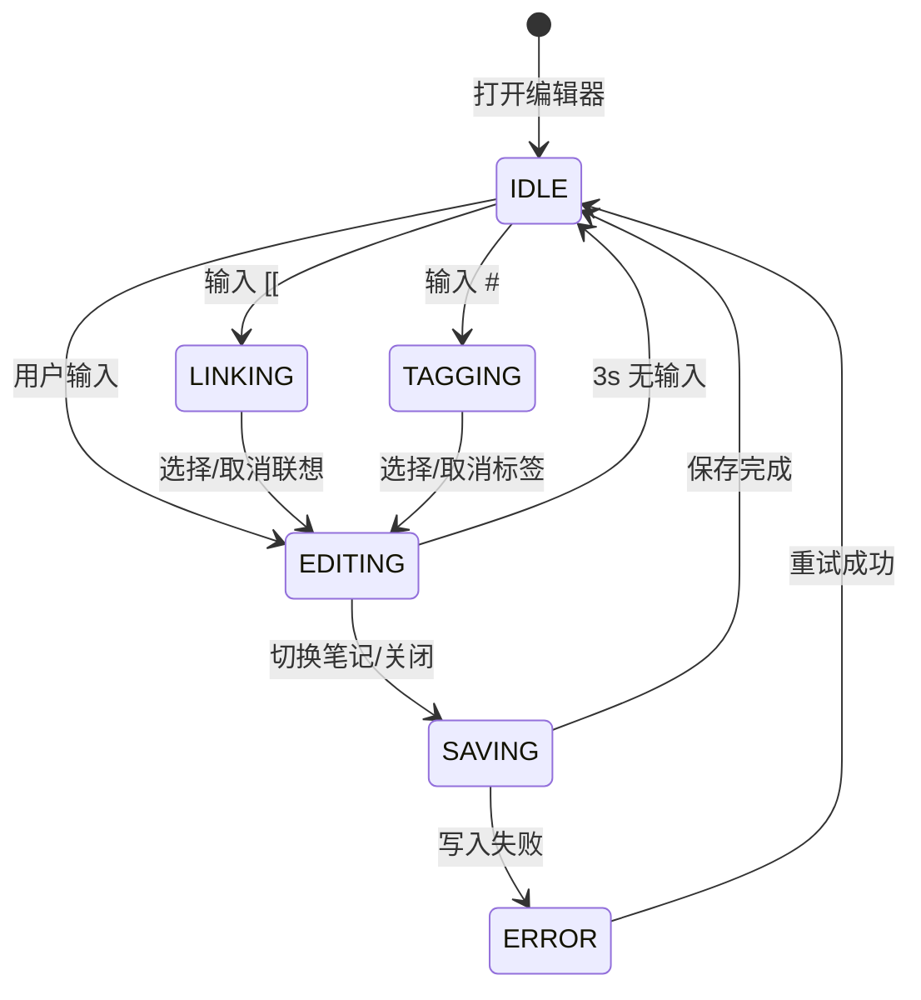
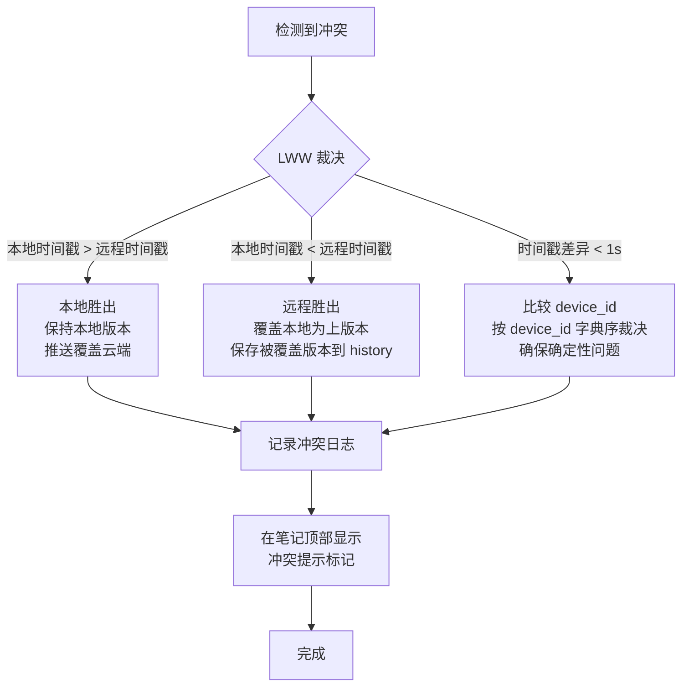
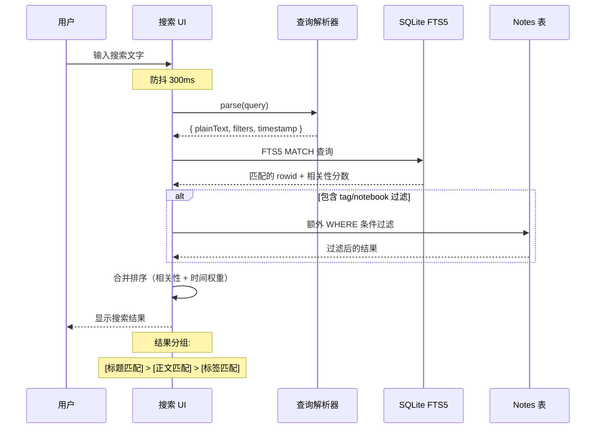
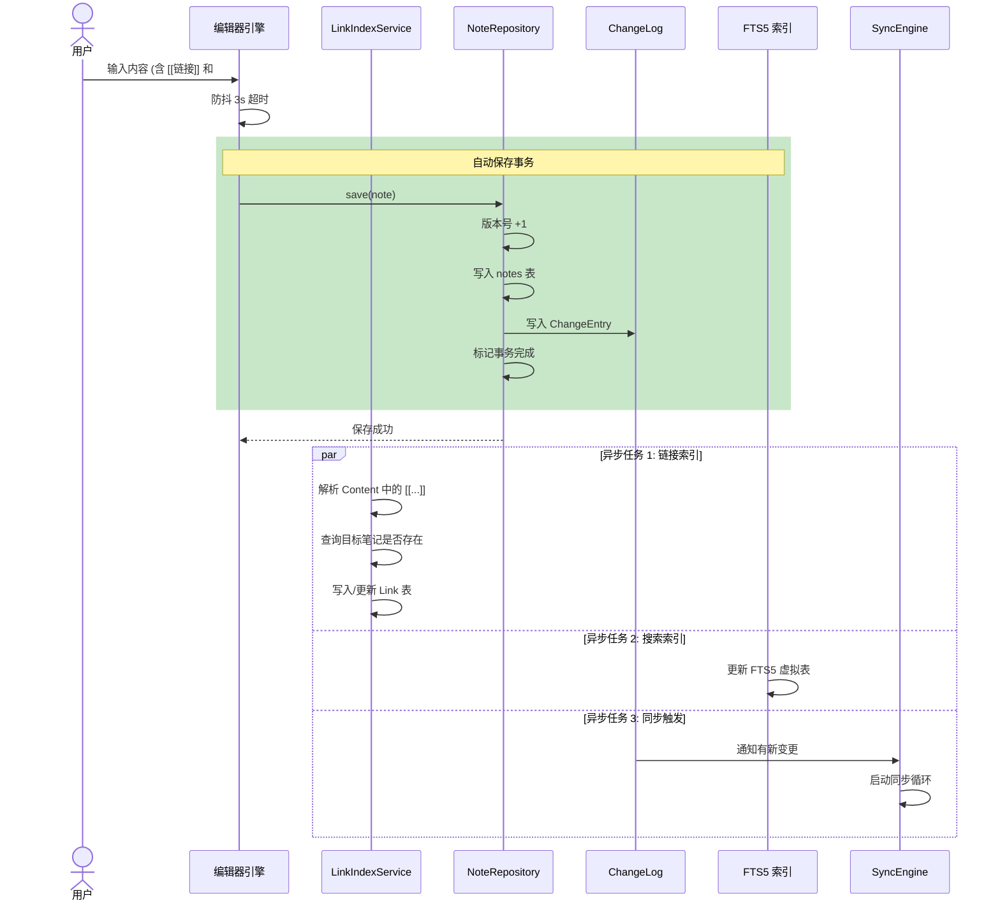
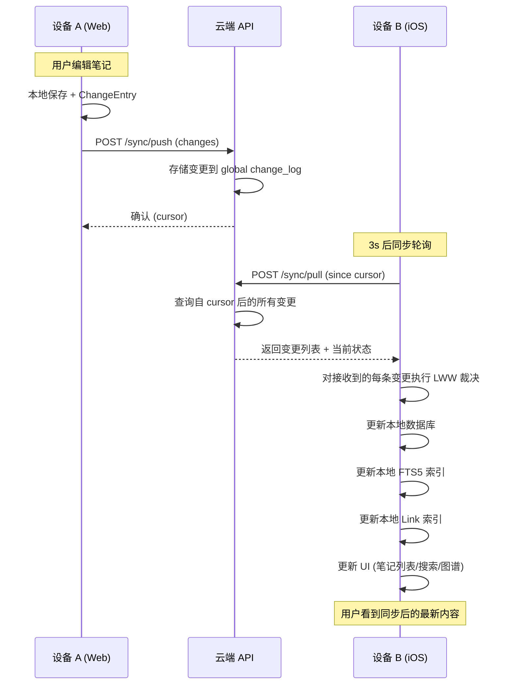
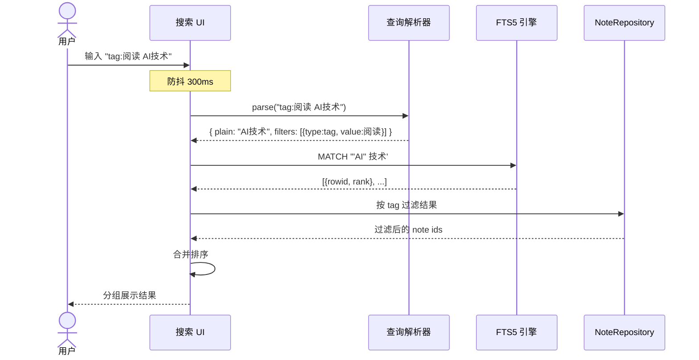
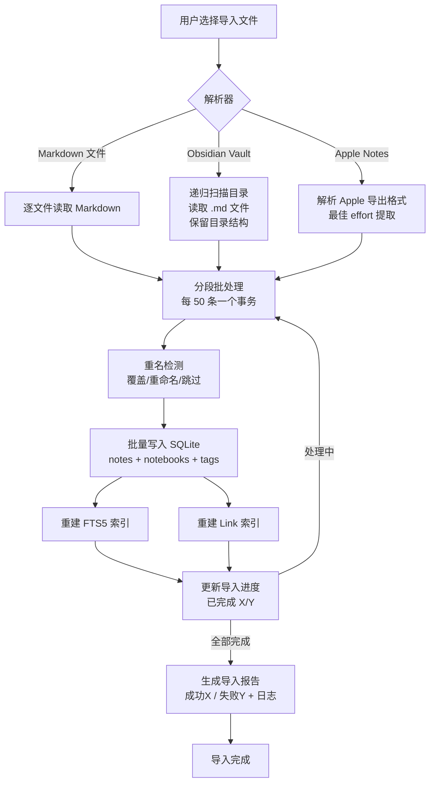
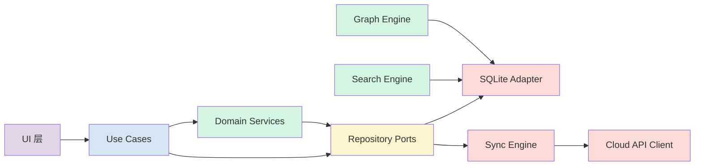

# MindFlow 组件/服务详细说明

**版本**: v0.1
**更新日期**: 2026-07-02

---

## 目录

1. [组件总览](#1-组件总览)
2. [编辑器引擎](#2-编辑器引擎)
3. [存储引擎](#3-存储引擎)
4. [同步引擎](#4-同步引擎)
5. [搜索引擎](#5-搜索引擎)
6. [图谱引擎](#6-图谱引擎)
7. [数据流分析](#7-数据流分析)

---

## 1. 组件总览

### 1.1 组件拓扑图

```mermaid
flowchart TB
    USER([用户])

    subgraph Client [客户端]
        subgraph UI [UI 层]
            EDITOR[编辑器组件\nMarkdown 编辑\n工具栏\n[[ 联想面板]
            ]
            GRAPH[图谱组件\n力导向图\n节点交互\n预览卡片]
            SEARCH_UI[搜索组件\n搜索输入\n结果列表\n操作符解析]
            SIDEBAR[侧边栏组件\n笔记本树\n标签树\n同步状态]
            NAV[导航组件\nTab 切换\n路由]
        end

        subgraph ENGINE [引擎层]
            EDITOR_ENGINE[编辑器引擎\nMarkdown 解析\n语法高亮\n增量渲染]
            STORAGE_ENGINE[存储引擎\nSQLite 读写\nRepository 实现\n事务管理]
            SYNC_ENGINE[同步引擎\n变更追踪\nPush/Pull\n冲突裁决]
            SEARCH_ENGINE[搜索引擎\nFTS5 索引构建\n查询解析\n排序计算]
            GRAPH_ENGINE[图谱引擎\n链接索引\n布局计算\n过滤聚合]
        end

        subgraph INFRA [基础设施层]
            DB[(SQLite 数据库\n笔记/笔记本/标签\n变更日志\nFTS5 索引)]
            STORE[(本地存储\n附件/配置\n缓存)]
            API_ADPT[REST 客户端\nCloud API 适配器]
        end

        UI --> ENGINE
        EDITOR <--> EDITOR_ENGINE
        GRAPH <--> GRAPH_ENGINE
        SEARCH_UI <--> SEARCH_ENGINE
        SIDEBAR --> STORAGE_ENGINE
        NAV --> STORAGE_ENGINE

        ENGINE --> INFRA
        STORAGE_ENGINE --> DB
        SEARCH_ENGINE --> DB
        GRAPH_ENGINE --> DB
        SYNC_ENGINE --> DB
        SYNC_ENGINE --> API_ADPT
    end

    Client <-->|HTTPS| CLOUD[云端服务]
```

### 1.2 组件职责矩阵

| 组件 | 所属层级 | 核心职责 | 对外接口 | 主要依赖 |
|------|---------|---------|---------|---------|
| 编辑器引擎 | 引擎层 | Markdown 解析渲染、`[[`/`#` 联想、自动保存触发 | `EditorEngine API` | Markdown 解析库 |
| 存储引擎 | 引擎层 | Repository 接口实现、SQLite CRUD、事务管理 | `NoteRepository` `NotebookRepository` `TagRepository` `LinkRepository` | SQLite |
| 同步引擎 | 引擎层 | 变更追踪、Push/Pull、LWW 冲突裁决、重试管理 | `SyncEngine` `SyncObserver` | 存储引擎、HTTP 客户端 |
| 搜索引擎 | 引擎层 | FTS5 索引构建维护、查询解析、结果排序 | `SearchEngine` `SearchIndexer` | SQLite FTS5 |
| 图谱引擎 | 引擎层 | 链接索引维护、布局计算、节点过滤聚合 | `GraphEngine` `LinkIndexer` | 存储引擎 |

---

## 2. 编辑器引擎

### 2.1 职责

- **Markdown 解析**：将输入的 Markdown 文本解析为 AST/块级结构，支持实时语法高亮
- **联想触发**：监测 `[[` 输入自动弹出笔记标题搜索建议；监测 `#` 输入触发标签联想
- **自动保存**：监测内容变更，根据防抖策略（停止输入 3s / 主动离开）触发持久化
- **光标管理**：维护光标位置，便于链接预览等功能定位上下文片段

### 2.2 状态模型



### 2.3 自动保存策略

```
触发条件:
  ┌─ 防抖超时: 用户停止输入 ≥ 3 秒
  ├─ 主动离开: 切换笔记 / 关闭标签页 / 退出 App
  └─ 强制保存: 前台切后台 / 浏览器 tab 隐藏

保存流程:
  1. 获取当前编辑器内容 (title + content)
  2. 计算 checksum = SHA256(title + content)
  3. 与上次保存的 checksum 比较
  4. 如果无变更 → 跳过
  5. 如果有变更 → 调用 NoteRepository.save(note)
     a. version += 1
     b. updated_at = now()
     c. device_id = current device
  6. NoteRepository 内部:
     a. 写入 notes 表
     b. 写入 ChangeEntry (operation: "update")
     c. 触发 LinkIndexService 重新解析链接
     d. 触发 SearchIndexService 更新 FTS5 索引
  7. 触发 SyncEngine 开始同步
```

### 2.4 `[[` 联想搜索接口

```typescript
interface LinkSuggestionService {
  /**
   * 根据用户输入的前缀搜索匹配的笔记标题
   * @param prefix 当前输入的 [[ 后的文本
   * @param limit 建议条数上限，默认 10
   * @returns 按相关度排序的笔记建议列表
   *
   * 搜索范围: 笔记标题
   * 匹配算法: SQLite LIKE '%prefix%' (不区分大小写)
   * 排序规则: 最近编辑时间倒序 (编辑越频繁越优先)
   */
  searchNotesByTitle(prefix: string, limit?: number): Promise<NoteSuggestion[]>;

  /**
   * 根据输入的前缀搜索匹配的标签
   * @param prefix 当前输入的 # 后的文本
   * @param limit 建议条数上限，默认 10
   */
  searchTagsByPrefix(prefix: string, limit?: number): Promise<TagSuggestion[]>;
}
```

---

## 3. 存储引擎

### 3.1 职责

- **Repository 实现**：实现 Domain 层定义的 `NoteRepository`、`NotebookRepository`、`TagRepository`、`LinkRepository` 接口
- **SQLite 读写**：封装所有 SQLite 操作，提供事务支持
- **加密**：对敏感字段（如本地缓存的身份令牌）进行加密存储

### 3.2 Repository 接口定义

```typescript
interface NoteRepository {
  findById(id: NoteId): Promise<Note | null>;
  findByIds(ids: NoteId[]): Promise<Note[]>;
  findByNotebookId(notebookId: NotebookId, options?: Pagination): Promise<Note[]>;
  searchByTitle(query: string, limit?: number): Promise<Note[]>;
  findRecent(limit: number): Promise<Note[]>;
  findDeleted(olderThan: Date): Promise<Note[]>; // 用于清理过期回收站
  save(note: Note): Promise<void>;
  softDelete(id: NoteId): Promise<void>;
  hardDelete(id: NoteId): Promise<void>; // 30 天后物理删除
}

interface NotebookRepository {
  findById(id: NotebookId): Promise<Notebook | null>;
  findRoots(): Promise<Notebook[]>; // parent_id IS NULL
  findChildren(parentId: NotebookId): Promise<Notebook[]>;
  findPath(id: NotebookId): Promise<Notebook[]>; // 完整路径
  save(notebook: Notebook): Promise<void>;
  delete(id: NotebookId, cascade: boolean): Promise<void>;
  reorder(id: NotebookId, newSortOrder: number): Promise<void>;
}

interface TagRepository {
  findById(id: TagId): Promise<TagGroup | null>;
  findRoots(): Promise<TagGroup[]>;
  findChildren(parentId: TagId): Promise<TagGroup[]>;
  findByNoteId(noteId: NoteId): Promise<TagGroup[]>;
  findNotesByTag(tagId: TagId, includeChildren: boolean): Promise<Note[]>;
  save(tag: TagGroup): Promise<void>;
  merge(sourceId: TagId, targetId: TagId): Promise<void>; // 标签合并
  rename(id: TagId, newPath: TagPath): Promise<void>; // 全局更名
  delete(id: TagId): Promise<void>;
}

interface LinkRepository {
  findBySourceNoteId(noteId: NoteId): Promise<Link[]>;
  findByTargetNoteId(noteId: NoteId): Promise<Link[]>; // 反向链接
  findBrokenLinks(): Promise<Link[]>; // 所有断链
  findByTargetTitle(title: string): Promise<Link[]>; // 重命名时查询
  saveAll(links: Link[]): Promise<void>; // 批量写入（全量替换）
  deleteBySourceNoteId(noteId: NoteId): Promise<void>; // 笔记删除时清除链接
}
```

### 3.3 关键 SQL 查询性能

| 查询场景 | SQL 策略 | 索引 | 预期性能（10000 笔记） |
|---------|---------|------|---------------------|
| 按 ID 查笔记 | `WHERE id = ?` | PK | < 5ms |
| 笔记列表（最近修改） | `ORDER BY updated_at DESC LIMIT 50` | `idx_notes_updated_at` | < 10ms |
| 按笔记本过滤 | `WHERE notebook_id = ? ORDER BY updated_at DESC` | `idx_notes_notebook_id` | < 20ms |
| 标题模糊搜索（联想） | `WHERE title LIKE ? ORDER BY updated_at DESC LIMIT 10` | `idx_notes_title` | < 30ms |
| 全文搜索 | FTS5 MATCH 查询 | FTS5 虚拟表 | < 500ms (5000 笔记) |
| 笔记本树 | `WHERE parent_id = ? ORDER BY sort_order` | `idx_notebooks_parent_id` | < 5ms |
| 反向链接 | `WHERE target_note_id = ?` | `idx_links_target` | < 10ms |
| 标签层级 | `WHERE parent_id = ? ORDER BY sort_order` | `idx_tags_parent_id` | < 5ms |
| 笔记标签关联 | JOIN note_tags + tags | `idx_note_tags_composite` | < 20ms |

### 3.4 事务边界

| 操作 | 事务范围 | 涉及表 |
|------|---------|-------|
| 创建笔记 | 单事务 | notes + note_tags + change_log + links + fts5 |
| 更新笔记内容 | 单事务 | notes + change_log + links + fts5 |
| 删除笔记 | 单事务 | notes (软删除) + change_log + links (清除) |
| 重命名笔记 | 单事务 | notes + change_log + links (更新引用) |
| 重命名标签 | 长事务（异步） | tags + note_tags + change_log（需重建所有关联） |
| 批量导入 | 分段事务（每 50 条一次） | 上述全部, 进度报告 |

---

## 4. 同步引擎

### 4.1 职责

- **变更追踪**：监听 Domain 层的所有写操作（通过 Repository 的 hook 或事件发布），生成 ChangeEntry 记录
- **Push/Pull**：与云端进行双向变更同步
- **冲突裁决**：基于 LWW 策略解决冲突，确保最终一致性
- **重试管理**：失败时指数退避重试，失败超过上限后通知用户
- **网络感知**：监听网络状态，在线时自动同步，离线时暂停

### 4.2 核心组件

```typescript
interface SyncEngine {
  /** 启动同步循环 */
  start(): Promise<void>;
  /** 停止同步循环 */
  stop(): Promise<void>;
  /** 强制触发一次全量同步 */
  triggerFullSync(): Promise<void>;
  /** 获取当前同步状态 */
  getStatus(): SyncStatus;
  /** 注册同步事件监听器 */
  onStatusChange(callback: (status: SyncStatus) => void): void;
}

interface SyncStatus {
  state: 'synced' | 'syncing' | 'offline' | 'error';
  pendingChangesCount: number;
  lastSyncAt: Date | null;
  lastError: string | null;
  isWiFi: boolean;
}

interface ConflictResolver {
  /**
   * LWW 冲突裁决
   * @param localVersion 本地版本的变更条目
   * @param remoteVersion 远程版本的变更条目
   * @param clockSkew 检测到的时钟偏移量
   * @returns 裁决结果
   */
  resolve(local: ChangeEntry, remote: ChangeEntry, clockSkew: number): ConflictResult;
}

interface ConflictResult {
  winner: 'local' | 'remote';
  loserSnapshot: string; // 被覆盖版本的 JSON 快照，存入版本历史
}
```

### 4.3 同步周期

```mermaid
sequenceDiagram
    participant App as MindFlow Client
    participant DB as Local SQLite
    participant Cloud as Cloud API

    Note over App: 阶段 1: 用户操作
    App->>DB: 保存笔记变更
    DB-->>App: OK (version += 1, checksum)
    App->>DB: 写入 ChangeEntry

    Note over App: 阶段 2: 推送本地变更
    loop 空闲循环 (每 3s)
        App->>DB: 查询未同步 ChangeEntry
        DB-->>App: 返回待同步条目 (最多 50 条)
        App->>Cloud: POST /sync/push
        alt 推送成功
            Cloud-->>App: 200 OK, 返回新 cursor
            App->>DB: 标记 ChangeEntry 为 synced
            App->>DB: 更新本地 SyncCursor
        else 推送冲突
            Cloud-->>App: 409 Conflict, 返回远程版本
            App->>App: 执行 LWW 裁决
            alt 本地胜出
                App->>Cloud: 重新推送本地版本
            else 远程胜出
                App->>DB: 覆盖本地版本
                App->>DB: 记录冲突版本到版本历史
            end
        else 网络错误
            App->>App: 指数退避，下次重试
        end
    end

    Note over App: 阶段 3: 拉取远程变更
    parallel
        App->>Cloud: POST /sync/pull (since cursor)
        Cloud-->>App: 返回其他设备的变更
        App->>App: 对每条变更执行 LWW 裁决
        App->>DB: 写入裁决后的最终版本
    end
```

### 4.4 更新冲突详细流程



### 4.5 ChangeEntry 详细格式

```typescript
interface ChangeEntry {
  id: number;              // 自增 ID, 同步队列中的排序依据
  entityType: 'note' | 'notebook' | 'tag';
  entityId: string;        // UUID
  operation: 'create' | 'update' | 'delete';
  deviceId: string;        // 操作来自哪个设备
  timestamp: string;       // ISO-8601, 操作发生时的本地时间
  payload: {
    // 对于 note 类型:
    title?: string;
    content?: string;
    notebookId?: string;
    tagIds?: string[];
    checksum?: string;
    version?: number;
    isDeleted?: boolean;
  };
  synced: boolean;         // 是否已推送到云端
  syncError: string | null;
  retryCount: number;      // 0-10, 超过 10 停止自动重试
  createdAt: string;       // ChangeEntry 创建时间
}
```

### 4.6 同步队列关键约束

| 属性 | 约束 |
|------|------|
| 队列实现 | SQLite `change_log` 表 |
| 空闲轮询间隔 | 3 秒（在线）/ 10 秒（后台） |
| 单次 Push 最大条目 | 50 条 |
| 单次 Pull 最大条目 | 100 条 |
| 重试策略 | 指数退避: 5s → 15s → 45s → 2min → 5min |
| 最大重试次数 | 10 次 |
| 网络切换触发 | 从离线切换到在线时，立即触发一轮同步 |
| 后台同步 | iOS 使用 BGTaskScheduler, Android 使用 WorkManager |

---

## 5. 搜索引擎

### 5.1 职责

- **FTS5 索引构建**：监听笔记内容的创建和更新事件，维护 SQLite FTS5 虚拟表
- **查询解析**：解析用户输入（包括高级操作符 `tag:` `from:` `before:`），构造 FTS5 查询
- **结果排序**：按相关性、引用量、最近编辑时间综合排序
- **联想补全**：为 `[[` 联想和标签联想提供实时搜索接口

### 5.2 索引策略

```sql
-- FTS5 虚拟表定义
CREATE VIRTUAL TABLE fts5_notes USING fts5(
    title,
    body,
    tag_ids,        -- 逗号分隔的标签 ID 列表，用于标签搜索
    content='',     -- 无外部 content 表（独立存储减少写放大）
    tokenize='unicode61 去除标点 tokenchars ''_'''
);

-- 每次笔记变更后执行 upsert
INSERT INTO fts5_notes(rowid, title, body, tag_ids)
VALUES (
    (SELECT rowid FROM notes WHERE id = ?),
    ?,
    ?,
    (SELECT group_concat(tag_id, ',') FROM note_tags WHERE note_id = ?)
);

-- 典型查询
SELECT n.id, n.title, n.updated_at,
       rank as relevance
FROM fts5_notes f
JOIN notes n ON n.rowid = f.rowid
WHERE fts5_notes MATCH ?
ORDER BY rank
LIMIT 20;
```

### 5.3 查询解析器

```
输入: "tag:阅读 from:上周 AI知识"

解析结果:
{
  plainText: "AI知识",              // 纯文本部分
  filters: [
    { type: 'tag', value: '阅读' },
    { type: 'from', value: '上周', parsed: DateRange }
  ]
}

FTS5 查询构造:
  fts5_notes MATCH '"AI" 知识'      // 简单的 AND 查询（MVP）
   + 应用 tag_ids LIKE '%阅读%'
   + 应用 updated_at >= '2026-06-25'
```

### 5.4 全文搜索执行流程



---

## 6. 图谱引擎

### 6.1 职责

- **链接索引维护**：通过解析 Note Content 中的 `[[链接标题]]` 语法，维护 Link 表
- **反向链接查询**：给定笔记 ID，查询所有引用该笔记的源笔记
- **断链检测**：当目标笔记被删除或重命名后，标记 Link 为断链
- **图谱布局计算**：封装力导向图布局算法，为 UI 层提供节点和边的位置数据
- **节点聚合过滤**：支持按笔记本/标签过滤图谱节点

### 6.2 链接索引更新时机

```
触发条件:
  ┌─ 笔记创建: 解析 Content, 提取所有 [[...]], 写入 Link 表
  ├─ 笔记更新: 全量删除该笔记的所有 Link, 重新解析 Content 写入
  ├─ 笔记删除: 删除源链接 + 目标链接标记为断链
  ├─ 笔记重命名: 更新所有指向该笔记的 Link.targetTitleSnapshot
  └─ 手动重建: 全量扫描所有笔记重建索引 (导入数据后)

注意:
  Link 索引不依赖事务一致性 — 允许短暂的读旧状态
  如果 LinkIndexService 正在处理, 新变更进入队列等待
```

### 6.3 图谱数据供给接口

```typescript
interface GraphDataProvider {
  /**
   * 获取图谱所需的全部节点和边数据
   * @param options 过滤条件
   * @returns 节点列表和边列表
   */
  getGraphData(options?: GraphFilterOptions): Promise<GraphData>;

  /**
   * 获取指定节点的一级关联子图
   * 用于节点聚焦展开
   */
  getEgoGraph(nodeId: string, depth?: number): Promise<GraphData>;

  /**
   * 搜索图谱中的节点
   */
  searchNodes(query: string): Promise<GraphNode[]>;
}

interface GraphData {
  nodes: GraphNode[];
  edges: GraphEdge[];
}

interface GraphNode {
  id: string;           // NoteId
  title: string;        // 笔记标题 (截断后)
  size: number;         // 节点大小 = max(1, ln(被引用数+1) * 3)
  group: string;        // 所属笔记本/标签分组 (用于着色)
  inboundCount: number; // 入链数
  outboundCount: number;// 出链数
}

interface GraphEdge {
  source: string;       // 源笔记 ID
  target: string;       // 目标笔记 ID
  weight: number;       // 边权重 (用于力导向图拉力计算)
  label: string;        // 引用文字摘要
}
```

### 6.4 力导向图性能策略

| 节点数量 | 渲染策略 | 预期帧率 |
|---------|---------|---------|
| < 100 | 全量渲染，高精度力模拟 | 60fps |
| 100 - 500 | 全量渲染，优化力模拟（减少迭代次数） | 60fps |
| 500 - 1000 | 强制提示性能降级，提供列表视图建议 | 30-45fps |
| > 1000 | 默认不渲染，提示使用筛选缩小范围 | — |

性能优化措施：
- 使用 Web Workers（Web） / 后台线程（移动端）运行力模拟计算
- 固定模拟迭代次数（300 次收敛），之后冻结布局
- 节点聚类：超过一定密度自动折叠为聚合节点
- 使用 GPU 加速渲染（Web: Canvas2D/WebGL, iOS: Metal, Android: Canvas）

---

## 7. 数据流分析

### 7.1 创建笔记数据流



### 7.2 跨设备同步数据流



### 7.3 搜索查询数据流



### 7.4 导入数据流（批量场景）



### 7.5 组件间事件通道

组件之间不直接耦合，通过以下**事件通道**进行通信：

| 事件 | 发布者 | 订阅者 | 触发条件 |
|------|--------|--------|---------|
| `note:created` | NoteRepository | 搜索引擎、图谱引擎、同步引擎 | 新笔记保存后 |
| `note:updated` | NoteRepository | 搜索引擎、图谱引擎、同步引擎 | 笔记内容变更后 |
| `note:deleted` | NoteRepository | 搜索引擎、图谱引擎、同步引擎 | 笔记软删除时 |
| `note:restored` | NoteRepository | 搜索引擎、图谱引擎、同步引擎 | 从回收站恢复时 |
| `notebook:renamed` | NotebookRepository | 图谱引擎（影响节点分组） | 笔记本重命名时 |
| `tag:renamed` | TagRepository | 搜索引擎（重新索引标签 ID） | 标签全局重命名时 |
| `sync:completed` | 同步引擎 | UI 层（刷新列表）、版本历史 | 一轮同步完成后 |
| `sync:status_changed` | 同步引擎 | UI 层（更新同步状态指示器） | 网络/同步状态变化时 |

---

## 8. 组件间依赖关系图



**依赖方向规则**：

```
UI → Application Use Cases → Domain Services + Port Interfaces
                                            ↓
                                    Infrastructure Adapters
                                            ↓
                                      SQLite / Cloud API
```

**禁止的依赖方向**：

```
Domain 层  →  Infrastructure 层    (禁止 — 域逻辑不得引用 SQLite、HTTP 等)
Domain 层  →  UI 层                (禁止 — 域逻辑不得引用展示逻辑)
Application → 特定 Adapter         (禁止 — 应用层只引用 Port 接口)
UI 层      →  Infrastructure 层    (禁止 — UI 必须通过 Use Cases 操作数据)
```
