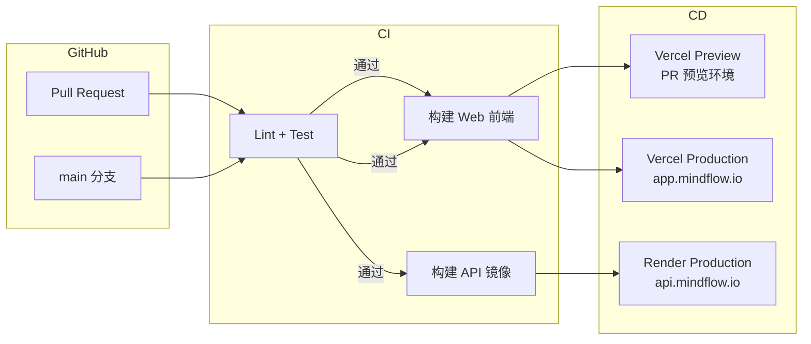

# MindFlow 部署拓扑

**版本**: v0.1
**更新日期**: 2026-07-02
**关联文档**: [系统架构总览](system.md) | [组件说明](components.md) | [ADR-0004](../decisions/0004-deployment-platform-selection.md)

---

## 目录

1. [部署平台总览](#1-部署平台总览)
2. [部署拓扑图](#2-部署拓扑图)
3. [各平台职责](#3-各平台职责)
4. [网络与安全](#4-网络与安全)
5. [CI/CD 流水线](#5-cicd-流水线)
6. [环境策略](#6-环境策略)
7. [成本预估](#7-成本预估)

---

## 1. 部署平台总览

| 平台 | 部署内容 | 层级 |
|------|---------|------|
| **Vercel** | Web 前端（React/TypeScript） | 静态资源托管 + 边缘网络 |
| **Render** | Sync API 后端服务（Go） | 容器化 Web Service |
| **Supabase** | PostgreSQL 数据库、认证、存储 | 托管数据库 + BaaS |
| **App Store / Google Play** | iOS / Android 客户端 | 移动端分发 |

---

## 2. 部署拓扑图

```mermaid
flowchart TB
    subgraph 用户设备 [用户设备]
        WEB_BROWSER[Web 浏览器]
        IOS_APP[iOS App\nSwiftUI]
        ANDROID_APP[Android App\nJetpack Compose]
    end

    subgraph Vercel [Vercel — 前端托管]
        WEB_CDN[边缘 CDN\n全球加速]
        WEB_STATIC[静态资源\nReact SPA]
        WEB_PREVIEW[Preview Deployments\nPR 预览环境]
    end

    subgraph Render [Render — 后端服务]
        API_SVC[Sync API\nGo Web Service]
        API_HEALTH[健康检查\n/health 端点]
    end

    subgraph Supabase [Supabase — 托管数据库 + BaaS]
        PG_DB[(PostgreSQL\n主数据库)]
        AUTH[Supabase Auth\nOAuth 2.0 + Email]
        STORAGE[Supabase Storage\n附件 + 备份]
        REALTIME[Supabase Realtime\n可选 WebSocket 推送]
    end

    subgraph 外部服务 [外部服务]
        GOOGLE_AUTH[Google OAuth]
        APPLE_AUTH[Apple OAuth]
    end

    %% 用户到前端
    WEB_BROWSER -->|HTTPS| WEB_CDN
    WEB_CDN --> WEB_STATIC
    WEB_CDN --> WEB_PREVIEW

    %% 前端/客户端到后端
    WEB_STATIC -->|HTTPS REST| API_SVC
    IOS_APP -->|HTTPS REST| API_SVC
    ANDROID_APP -->|HTTPS REST| API_SVC

    %% 后端到数据库
    API_SVC -->|pgBouncer 连接池| PG_DB

    %% 客户端到 Supabase
    IOS_APP -->|HTTPS| AUTH
    ANDROID_APP -->|HTTPS| AUTH
    WEB_STATIC -->|HTTPS| AUTH

    %% OAuth 外部认证
    AUTH -->|OAuth 2.0| GOOGLE_AUTH
    AUTH -->|OAuth 2.0| APPLE_AUTH

    %% 存储
    API_SVC -->|SDK| STORAGE

    %% 可选实时推送
    IOS_APP -.->|WebSocket (v1.5+)| REALTIME
    ANDROID_APP -.->|WebSocket (v1.5+)| REALTIME
    WEB_STATIC -.->|WebSocket (v1.5+)| REALTIME

    %% 样式
    style Vercel fill:#e1f5fe,stroke:#01579b
    style Render fill:#fff3e0,stroke:#e65100
    style Supabase fill:#e8f5e9,stroke:#1b5e20
```

---

## 3. 各平台职责

### 3.1 Vercel — Web 前端托管

| 能力 | 说明 |
|------|------|
| **静态资源托管** | React SPA build 产物（HTML/JS/CSS/WASM）托管在 Vercel 边缘网络 |
| **全球 CDN** | 自动分发到 Vercel Edge Network，全球 100+ 节点 |
| **自动 HTTPS** | 内置 Let's Encrypt SSL 证书自动续期 |
| **Preview Deployments** | 每个 PR 自动部署独立预览环境 |
| **自定义域名** | 绑定 `app.mindflow.io` |
| **环境变量管理** | Vercel Environment Variables 注入 `VITE_API_BASE_URL` 等 |

**关键配置**：

```ini
# vercel.json
{
  "framework": "vite",
  "buildCommand": "pnpm build",
  "outputDirectory": "dist",
  "routes": [
    {
      "src": "/api/(.*)",
      "dest": "https://api.mindflow.io/api/$1"
    }
  ]
}
```

### 3.2 Render — 后端 API 服务

| 能力 | 说明 |
|------|------|
| **运行时** | Go Web Service（Docker 容器） |
| **实例规格** | Starter（512 MB RAM / 1 vCPU）起步，按需自动扩缩容 |
| **健康检查** | HTTP GET `/api/v1/health`，自动重启不健康实例 |
| **零停机部署** | 滚动更新，旧实例处理完现有请求后下线 |
| **日志** | 标准输出 → Render Log Stream，可对接外部日志服务 |
| **自定义域名** | 绑定 `api.mindflow.io` |
| **环境变量** | Render Environment Variables 注入 `SUPABASE_URL`、`SUPABASE_SERVICE_ROLE_KEY` 等 |

**关键配置**：

```yaml
# render.yaml
services:
  - type: web
    name: mindflow-api
    runtime: go
    buildCommand: go build -o server ./cmd/server
    startCommand: ./server
    healthCheckPath: /api/v1/health
    envVars:
      - key: SUPABASE_URL
        sync: false
      - key: SUPABASE_SERVICE_ROLE_KEY
        sync: false
      - key: DATABASE_URL
        fromDatabase:
          name: mindflow-db
          property: connectionString
```

### 3.3 Supabase — 托管数据库 + BaaS

| 能力 | 说明 |
|------|------|
| **PostgreSQL** | 托管 PostgreSQL 15+，自动备份、时间点恢复 |
| **Auth** | 内置 OAuth 2.0（Google/Apple）+ Email/密码认证 |
| **Storage** | S3 兼容对象存储，用于附件和备份文件 |
| **Row Level Security** | 数据库级别的行级安全策略 |
| **实时订阅** | Postgres CDC → WebSocket 推送（v1.5+ 启用） |
| **连接池** | 内置 pgBouncer，Render 后端通过连接池访问 |

**关键表策略**：

```sql
-- Supabase Row Level Security 示例
ALTER TABLE notes ENABLE ROW LEVEL SECURITY;

CREATE POLICY "Users can only access their own notes"
  ON notes FOR ALL
  USING (auth.uid() = user_id)
  WITH CHECK (auth.uid() = user_id);
```

### 3.4 移动端分发

| 平台 | 分发渠道 | 说明 |
|------|---------|------|
| iOS | App Store + TestFlight | SwiftUI 原生应用 |
| Android | Google Play + Internal Testing | Jetpack Compose 原生应用 |

移动端直接与 Render API 和 Supabase Auth 通信，不经过 Vercel。

---

## 4. 网络与安全

### 4.1 通信链路

```
Web 浏览器 ──HTTPS──→ Vercel CDN ──→ 静态资源
Web 浏览器 ──HTTPS──→ Render API ──连接池──→ Supabase PostgreSQL
Web 浏览器 ──HTTPS──→ Supabase Auth ──→ OAuth Provider

iOS/Android ──HTTPS──→ Render API ──连接池──→ Supabase PostgreSQL
iOS/Android ──HTTPS──→ Supabase Auth ──→ OAuth Provider
```

### 4.2 安全措施

| 层级 | 措施 |
|------|------|
| **传输层** | 全链路 HTTPS（TLS 1.3） |
| **认证层** | JWT Access Token（2h 过期）+ Refresh Token（30d 过期） |
| **数据库** | RLS 行级安全 + pgBouncer 连接池 + IP 白名单 |
| **API** | Rate Limiting（按用户/端点）+ Idempotency Key |
| **密钥管理** | Vercel/Render 环境变量 + Supabase Vault（加密存储） |

---

## 5. CI/CD 流水线



### 5.1 流水线详情

| 触发条件 | 行为 |
|----------|------|
| **PR 创建/更新** | Lint + Test → Vercel Preview Deployment |
| **合并到 main** | Lint + Test → Vercel Production + Render 滚动更新 |
| **手动触发** | 支持 Vercel CLI / Render Deploy Hook 手动部署 |

---

## 6. 环境策略

| 环境 | Vercel | Render | Supabase |
|------|--------|--------|----------|
| **Production** | `app.mindflow.io` | `api.mindflow.io` | Production 项目 |
| **Staging** | `staging.mindflow.io` | `api-staging.mindflow.io` | Staging 分支（Supabase Branching） |
| **Preview** | `<pr-slug>.vercel.app` | — | Supabase Preview 分支 |

---

## 7. 成本预估

### 7.1 MVP 阶段（W1-W12）

| 平台 | 方案 | 月费（预估） | 说明 |
|------|------|------------|------|
| **Vercel** | Pro（$20/月） | $20 | 含 Preview Deployments、Analytics |
| **Render** | Starter（$7/月） | $7 | 512 MB RAM / 1 vCPU |
| **Supabase** | Pro（$25/月） | $25 | 8 GB DB、100 GB Storage、50K MAU |
| **域名** | `mindflow.io` | ~$1 | 年费 $12 |
| **合计** | | **~$53/月** | MVP 阶段 |

### 7.2 扩展阶段预估（DAU 10,000+）

| 平台 | 方案 | 月费（预估） |
|------|------|------------|
| Vercel | Pro + 额外带宽 | $20-100 |
| Render | Standard（1-2 GB RAM） | $25-85 |
| Supabase | Team（$599/月） | $599 |
| **合计** | | **$644-784/月** |

---

## 附录 A：平台选型理由

详见 [ADR-0004：部署平台选型](../decisions/0004-deployment-platform-selection.md)。

核心选择依据：

| 平台 | 关键理由 |
|------|---------|
| Vercel | 前端天然适配，边缘网络加速全球访问，Preview 环境极简 |
| Render | 容器化 Go 服务零配置部署，自动 HTTPS + 滚动更新 |
| Supabase | 统一 PostgreSQL + Auth + Storage，减少服务集成复杂度 |

## 附录 B：本地开发环境

```
本地开发拓扑:

  Web Dev (localhost:5173) ──→ Vite Dev Server
                              ──→ Local Render API (localhost:8080)
                              ──→ Supabase Local (supabase start)

  iOS Simulator ──→ Local Render API (localhost:8080)
                 ──→ Supabase Local (localhost:54321)

  Supabase CLI:
    supabase start      # 启动本地 Supabase（PostgreSQL + Auth + Storage）
    supabase db reset   # 重置本地数据库到最新 migration
    supabase link       # 关联远程 Supabase 项目
    supabase db push    # 推送本地 schema 变更到远程
```
