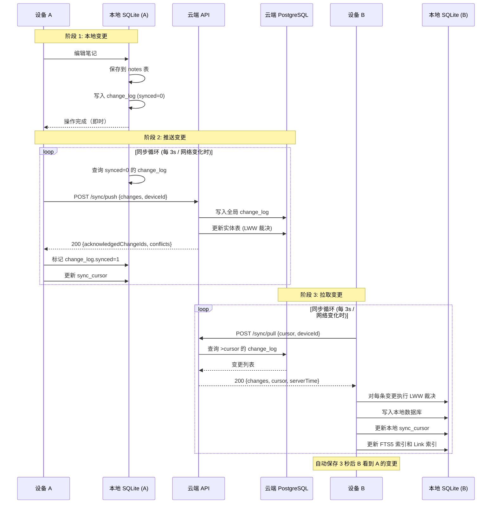
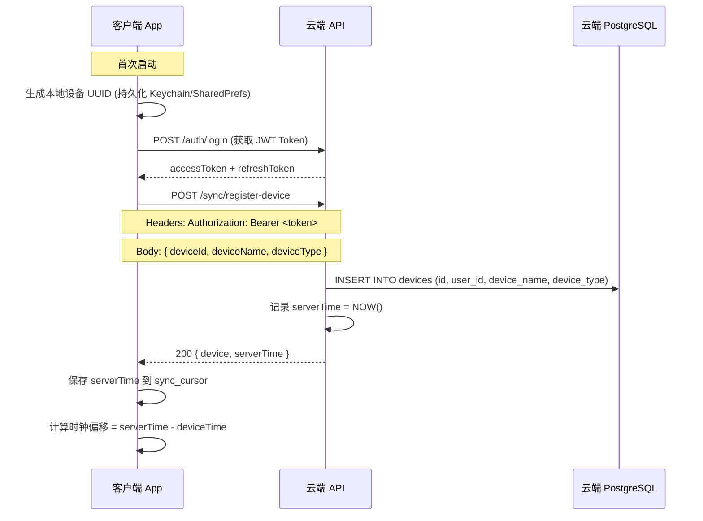
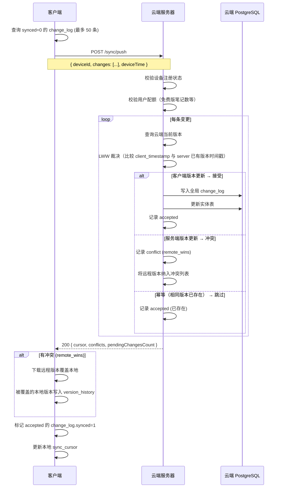
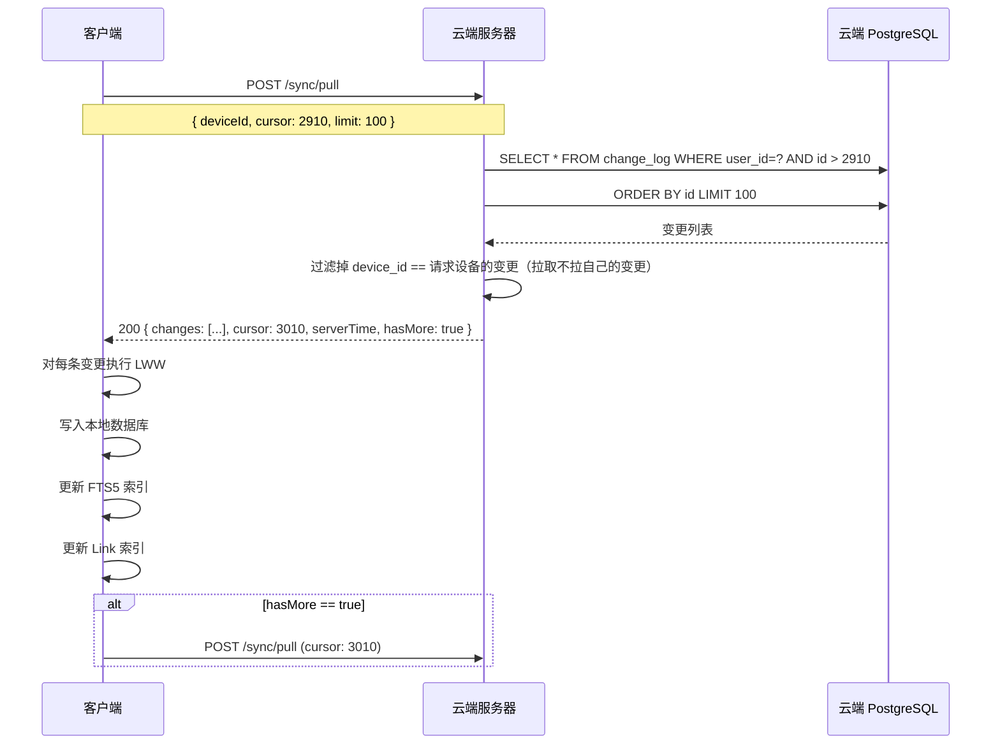
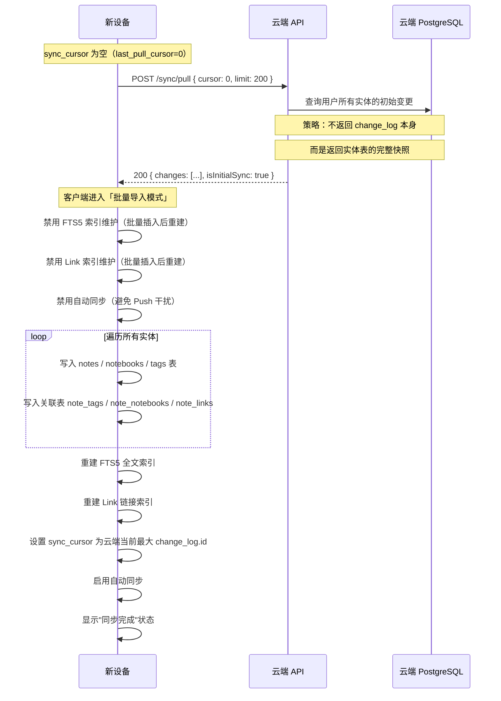
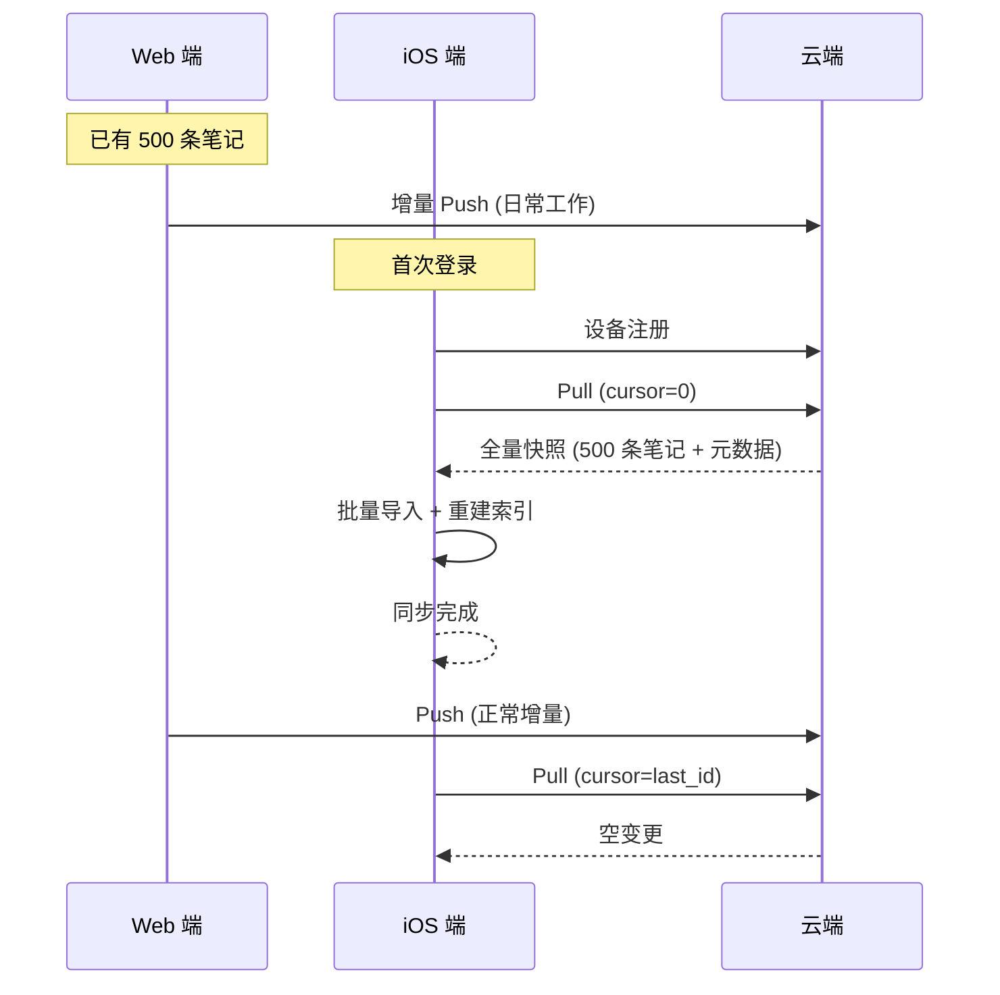
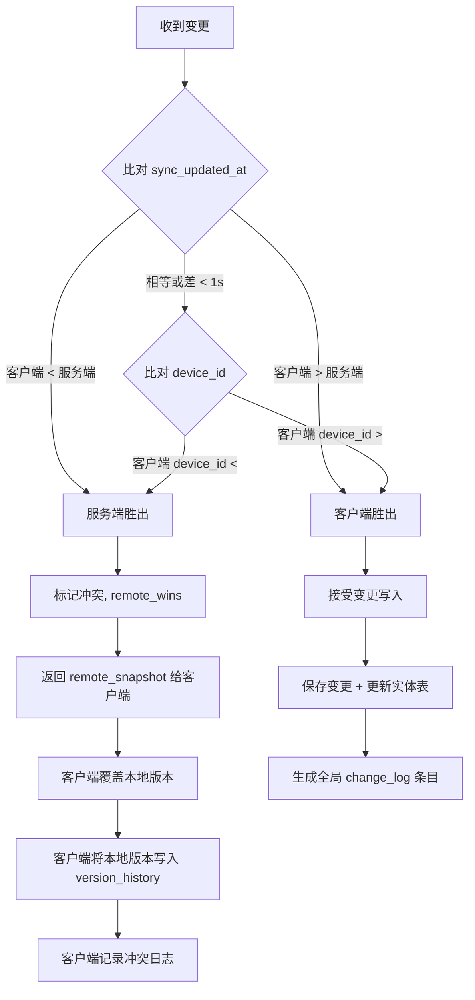
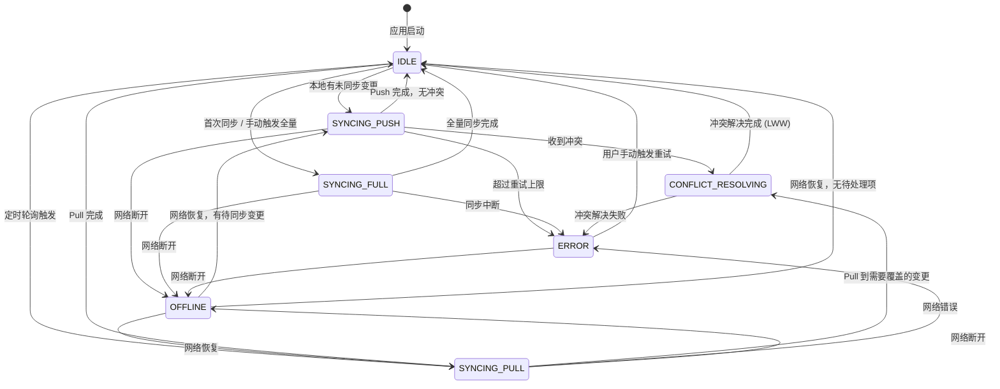
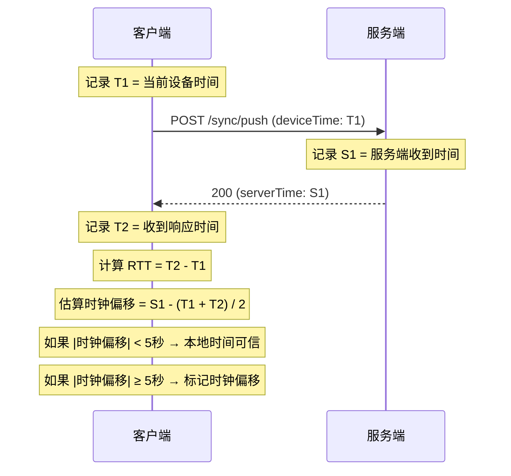

# 同步协议设计：MindFlow 跨设备同步

> **版本**: v1.0
> **更新日期**: 2026-07-02
> **关联文档**: [数据库 Schema](../database/schema.md) | [REST API](../api/rest/openapi.yaml)

---

## 目录

1. [同步架构总览](#1-同步架构总览)
2. [设备注册与认证](#2-设备注册与认证)
3. [本地变更跟踪机制](#3-本地变更跟踪机制)
4. [增量推送流程（客户端 -> 云端）](#4-增量推送流程客户端---云端)
5. [增量拉取流程（云端 -> 客户端）](#5-增量拉取流程云端---客户端)
6. [首次全量同步](#6-首次全量同步)
7. [冲突检测与 LWW 裁决](#7-冲突检测与-lww-裁决)
8. [同步重试与幂等性](#8-同步重试与幂等性)
9. [同步状态机](#9-同步状态机)
10. [时钟偏移处理](#10-时钟偏移处理)
11. [限流与配额控制](#11-限流与配额控制)

---

## 1. 同步架构总览

### 1.1 核心设计原则

| 原则 | 说明 |
|------|------|
| **离线优先** | 本地数据库是真理源，所有操作先写入本地，同步是后台异步行为 |
| **增量同步** | 仅传输变更部分（ChangeLog 中的增量数据），从不全量传输 |
| **LWW 裁决** | Last-Writer-Wins，以服务器接收时间戳为权威依据 |
| **最终一致性** | 允许短暂不一致（P95 < 3s），但最终所有设备收敛到相同数据 |
| **设备隔离** | 每设备独立变更队列，Push 与 Pull 管道分离 |

### 1.2 系统交互图



### 1.3 同步触发时机

| 触发条件 | 行为 | 优先级 |
|----------|------|--------|
| 本地变更写入后 | 立即启动同步循环 | 高 |
| 定时轮询（在线） | 每 3 秒一次 Pull | 中 |
| 定时轮询（后台） | 每 10 秒一次 Pull | 低 |
| 网络恢复（离线 -> 在线） | 立即触发全力同步 | 高 |
| App 后台刷新 | 由系统调度（iOS BGTaskScheduler / Android WorkManager） | 低 |
| 用户手动下拉刷新 | 立即触发一次 Pull | 高 |

---

## 2. 设备注册与认证

### 2.1 设备生命周期

```
首次启动 → 生成 device_id (UUID v4) → 注册设备 → 获取 server_time → 
正常同步 → 可选吊销 → 注销
```

### 2.2 设备注册流程



### 2.3 请求格式

```json
POST /api/v1/sync/register-device
Authorization: Bearer <accessToken>
Content-Type: application/json

{
  "device_id": "a1b2c3d4-...-uuid",
  "device_name": "Turbo's MacBook Pro",
  "device_type": "web",
  "fcm_token": null
}
```

### 2.4 响应格式

```json
HTTP/1.1 200 OK
Content-Type: application/json

{
  "device": {
    "id": "a1b2c3d4-...-uuid",
    "device_name": "Turbo's MacBook Pro",
    "device_type": "web",
    "last_seen_at": "2026-07-02T10:30:00.000Z",
    "is_active": true,
    "created_at": "2026-07-02T10:30:00.000Z"
  },
  "server_time": "2026-07-02T10:30:00.123Z"
}
```

### 2.5 设备吊销

当用户在设置中「吊销设备」时：
1. 客户端调用 `DELETE /api/v1/user/devices/{deviceId}`
2. 服务端设置 `devices.is_active = false`
3. 被吊销设备的 sync token 失效，下次同步返回 401
4. 被吊销设备上的 JWT refresh 依然有效但 Push/Pull 被拒绝

---

## 3. 本地变更跟踪机制

### 3.1 Change Log 表结构

本地 `change_log` 表是同步队列的核心。每次数据变更（create / update / delete）都会写入一条记录。

```sql
-- 本地 SQLite (每设备独立维护)
CREATE TABLE change_log (
    id INTEGER PRIMARY KEY AUTOINCREMENT,
    entity_type TEXT NOT NULL CHECK (entity_type IN (
        'note', 'notebook', 'tag', 'notebook_ref', 'tag_ref'
    )),
    entity_id TEXT NOT NULL,
    operation TEXT NOT NULL CHECK (operation IN ('create', 'update', 'delete')),
    device_id TEXT NOT NULL,
    timestamp TEXT NOT NULL,              -- ISO-8601, 变更发生时客户端时间
    payload TEXT NOT NULL,                -- JSON 序列化的变更数据快照
    version INTEGER NOT NULL,             -- 变更后 sync_version
    checksum TEXT NULL,                   -- 变更后校验和(仅 note)
    synced INTEGER NOT NULL DEFAULT 0,    -- 是否已推送至云端
    sync_error TEXT NULL,                 -- 最后同步错误
    retry_count INTEGER NOT NULL DEFAULT 0, -- 重试次数
    created_at TEXT NOT NULL
);
```

### 3.2 实体类型说明

| entity_type | 含义 | payload 包含 |
|-------------|------|-------------|
| `note` | 笔记变更 | title, body, checksum, version, is_deleted |
| `notebook` | 笔记本变更 | name, parent_id, sort_order |
| `tag` | 标签变更 | name, path, parent_id |
| `notebook_ref` | 笔记-笔记本关联变更 | note_id, notebook_ids[] (全量替换) |
| `tag_ref` | 笔记-标签关联变更 | note_id, tag_ids[] (全量替换) |

**设计决策**：
- 笔记的 `notebook_ids` 和 `tag_ids` 变更使用独立的 `notebook_ref` / `tag_ref` 实体类型，而不是嵌入 `note` 变更中。这使得关联变更可以独立同步和冲突裁决，避免笔记正文变更和标签变更互相干扰。

### 3.3 写入时机

在任何数据写入操作完成后，同步引擎同步写入 `change_log`：

```typescript
// 伪代码：保存笔记时的 Change Log 写入
async function saveNote(note: Note): Promise<void> {
  // 1. 写入笔记主表
  note.syncVersion += 1;
  note.checksum = sha256(note.title + note.body);
  await db.notes.save(note);
  
  // 2. 写入变更日志
  await db.changeLog.insert({
    entityType: 'note',
    entityId: note.id,
    operation: 'update',      // 或 'create' / 'delete'
    deviceId: currentDeviceId,
    timestamp: new Date().toISOString(),
    payload: {
      title: note.title,
      body: note.body,
      checksum: note.checksum,
      version: note.syncVersion,
      isDeleted: note.isDeleted
    },
    version: note.syncVersion,
    checksum: note.checksum,
    synced: 0
  });
  
  // 3. 如果标签也变了，写入 tag_ref 变更
  if (tagIdsChanged) {
    await db.changeLog.insert({
      entityType: 'tag_ref',
      entityId: note.id,
      operation: 'update',
      // ...
    });
  }
  
  // 4. 触发同步引擎
  syncEngine.notifyChange();
}
```

### 3.4 查询待同步变更

```sql
-- 查询所有未同步的变更，按 ID 排序（FIFO 顺序）
SELECT * FROM change_log
WHERE synced = 0
ORDER BY id ASC
LIMIT 50;
```

### 3.5 变更日志清理

- 标记为 `synced=1` 的变更记录保留 **7 天** 后清理（用于调试和冲突排查）
- 7 天后：`DELETE FROM change_log WHERE synced=1 AND created_at < datetime('now', '-7 days')`

---

## 4. 增量推送流程（客户端 -> 云端）

### 4.1 推送协议



### 4.2 请求格式

```json
POST /api/v1/sync/push
Authorization: Bearer <accessToken>
Content-Type: application/json
Idempotency-Key: 550e8400-e29b-41d4-a716-446655440000

{
  "device_id": "a1b2c3d4-...",
  "device_time": "2026-07-02T10:30:05.000Z",
  "changes": [
    {
      "change_id": 1290,
      "entity_type": "note",
      "entity_id": "note-uuid-001",
      "operation": "update",
      "timestamp": "2026-07-02T10:30:05.000Z",
      "device_id": "a1b2c3d4-...",
      "version": 5,
      "checksum": "e3b0c44298fc1c149afbf4c8996fb92427ae41e4649b934ca495991b7852b855",
      "payload": {
        "title": "关于 DDD 的思考",
        "body": "# 领域驱动设计\n\n今天学习了 DDD 的核心概念...",
        "checksum": "e3b0c44298fc1c149afbf4c8996fb92427ae41e4649b934ca495991b7852b855",
        "version": 5,
        "is_deleted": false
      }
    },
    {
      "change_id": 1291,
      "entity_type": "tag_ref",
      "entity_id": "note-uuid-001",
      "operation": "update",
      "timestamp": "2026-07-02T10:30:05.000Z",
      "device_id": "a1b2c3d4-...",
      "version": 1,
      "checksum": null,
      "payload": {
        "note_id": "note-uuid-001",
        "tag_ids": ["tag-uuid-a", "tag-uuid-b"],
        "notebook_ids": ["nb-uuid-x"]
      }
    }
  ]
}
```

### 4.3 响应格式

```json
HTTP/1.1 200 OK
Content-Type: application/json

{
  "cursor": {
    "server_time": "2026-07-02T10:30:06.123Z",
    "acknowledged_change_ids": [1290, 1291],
    "last_change_id": 2910
  },
  "conflicts": [],
  "pending_changes_count": 5
}
```

**冲突响应示例**：

```json
HTTP/1.1 200 OK
Content-Type: application/json

{
  "cursor": {
    "server_time": "2026-07-02T10:30:06.123Z",
    "acknowledged_change_ids": [1290],
    "last_change_id": 2910
  },
  "conflicts": [
    {
      "change_id": 1290,
      "entity_type": "note",
      "entity_id": "note-uuid-001",
      "local_version": 5,
      "remote_version": 6,
      "resolution": "remote_wins",
      "remote_snapshot": {
        "title": "关于 DDD 和事件风暴的思考",
        "body": "# 领域驱动设计\n\n更新后的版本...",
        "checksum": "abc123...",
        "version": 6
      }
    }
  ],
  "pending_changes_count": 3
}
```

### 4.4 服务端处理逻辑（伪码）

```typescript
// 服务端 Push 处理
function handlePush(userId, deviceId, changes, deviceTime) {
  const serverTime = new Date().toISOString();
  const results = [];
  const conflicts = [];
  
  for (const change of changes) {
    // 1. 幂等检测：是否已有相同 change_id / version 的变更
    const existing = db.changeLog.findExisting(userId, change.entityType, change.entityId, change.version);
    if (existing) {
      results.push({ changeId: change.changeId, status: 'accepted' });
      continue;
    }
    
    // 2. 查询云端当前版本
    const currentEntity = db.entities.findLatest(userId, change.entityType, change.entityId);
    
    if (currentEntity) {
      // 3. LWW 裁决
      const currentTimestamp = currentEntity.syncUpdatedAt;
      const incomingTimestamp = change.timestamp;
      
      if (incomingTimestamp > currentTimestamp) {
        // 客户端版本更新 -> 接受
        acceptChange(userId, deviceId, change, serverTime);
        results.push({ changeId: change.changeId, status: 'accepted' });
      } else if (incomingTimestamp < currentTimestamp) {
        // 服务端版本更新 -> 冲突
        conflicts.push({
          changeId: change.changeId,
          entityType: change.entityType,
          entityId: change.entityId,
          localVersion: change.version,
          remoteVersion: currentEntity.syncVersion,
          resolution: 'remote_wins',
          remoteSnapshot: currentEntity
        });
      } else {
        // 时间戳完全相同（罕见） -> 按 device_id 字典序裁决
        if (deviceId > currentEntity.deviceId) {
          acceptChange(userId, deviceId, change, serverTime);
          results.push({ changeId: change.changeId, status: 'accepted' });
        } else {
          conflicts.push({ ... }); // remote_wins
        }
      }
    } else {
      // 实体不存在 -> 新创建
      acceptChange(userId, deviceId, change, serverTime);
      results.push({ changeId: change.changeId, status: 'accepted' });
    }
  }
  
  // 4. 更新设备最后活跃时间
  db.devices.updateLastSeen(deviceId, serverTime);
  
  // 5. 统计待拉取变更数
  const pendingCount = db.changeLog.countPending(userId, deviceId);
  
  return {
    cursor: {
      serverTime,
      acknowledgedChangeIds: results.map(r => r.changeId),
      lastChangeId: db.changeLog.getMaxId(userId)
    },
    conflicts,
    pendingChangesCount: pendingCount
  };
}
```

---

## 5. 增量拉取流程（云端 -> 客户端）

### 5.1 拉取协议



### 5.2 请求格式

```json
POST /api/v1/sync/pull
Authorization: Bearer <accessToken>
Content-Type: application/json

{
  "device_id": "y5z6-...-uuid",
  "cursor": 2910,
  "limit": 100,
  "device_time": "2026-07-02T10:31:00.000Z"
}
```

### 5.3 响应格式

```json
HTTP/1.1 200 OK
Content-Type: application/json

{
  "changes": [
    {
      "change_id": 2911,
      "entity_type": "note",
      "entity_id": "note-uuid-002",
      "operation": "update",
      "timestamp": "2026-07-02T10:30:06.000Z",
      "device_id": "a1b2c3d4-...",
      "version": 3,
      "checksum": "def456...",
      "payload": {
        "title": "MindFlow 同步设计",
        "body": "# 同步协议\n\n今天完成了同步协议的设计...",
        "checksum": "def456...",
        "version": 3,
        "is_deleted": false
      }
    },
    {
      "change_id": 2912,
      "entity_type": "note",
      "entity_id": "note-uuid-003",
      "operation": "delete",
      "timestamp": "2026-07-02T10:30:07.000Z",
      "device_id": "a1b2c3d4-...",
      "version": 7,
      "checksum": null,
      "payload": {
        "title": "临时笔记",
        "is_deleted": true
      }
    }
  ],
  "cursor": 3010,
  "server_time": "2026-07-02T10:31:01.000Z",
  "has_more": false
}
```

### 5.4 客户端拉取处理逻辑（伪码）

```typescript
// 客户端 Pull 处理
async function handlePull() {
  const cursor = await db.syncCursor.getLastPullCursor();
  
  const response = await api.syncPull({
    deviceId: currentDeviceId,
    cursor: cursor,
    limit: 100
  });
  
  for (const change of response.changes) {
    // 1. 排除自己设备产生的变更（拉取时已由服务端过滤，但客户端二次确认）
    if (change.device_id === currentDeviceId) continue;
    
    // 2. 查询本地的当前版本
    const localEntity = await db.findEntity(change.entityType, change.entityId);
    
    // 3. LWW 裁决
    if (!localEntity) {
      // 本地不存在 -> 直接应用
      await applyChange(change);
    } else if (timestampCompare(change.timestamp, localEntity.syncUpdatedAt) > 0) {
      // 远程更新 -> 覆盖本地
      await applyChange(change);
      // 本地被覆盖的版本保存到 version_history
      await saveToVersionHistory(localEntity, 'conflict');
    } else {
      // 本地更新 -> 跳过
      // 这种情况下，本地应该很快会 push 给服务器
    }
  }
  
  // 4. 更新拉取游标
  await db.syncCursor.updatePullCursor(response.cursor);
  
  // 5. 如果还有更多，继续拉取
  if (response.has_more) {
    await handlePull();
  }
}
```

### 5.5 重要设计：排除自身变更

服务端在查询 change_log 时，自动排除 `device_id == 请求设备ID` 的变更。这是因为：
- 本设备刚刚推送的变更已经由 Push 响应确认
- 避免重复应用自己产生的变更
- 每个设备只看"别人"做了什么

---

## 6. 首次全量同步

### 6.1 触发条件

首次同步在以下场景发生：
1. 新设备注册后首次同步
2. 本地数据库被清除后的恢复
3. 用户手动触发「重新同步」

### 6.2 全量同步流程



### 6.3 全量同步端点设计

全量同步使用与增量 Pull 相同的端点，但 `cursor=0` 触发特殊处理：

- 服务端检测到 `cursor=0` 时，不在 change_log 中线性扫描
- 改为直接 dump 用户所有活跃实体（笔记、笔记本、标签、关联）的完整快照
- 以 change_log 格式返回（`operation: 'create'`）
- `isInitialSync: true` 标记告知客户端进入批量导入模式

### 6.4 批量导入模式优化

| 优化措施 | 说明 |
|----------|------|
| 禁用索引 | 关闭 FTS5 和 Link 索引的增量维护，避免每条记录重复触发 |
| 分段事务 | 每 200 条笔记一个事务提交，避免单一大事务 |
| 批量重建 | 数据全部写入后，一次性重建 FTS5 和 Link 索引 |
| 分页加载 | 超过 1000 条笔记时分页拉取，不阻塞 UI |
| 进度反馈 | 显示全量同步进度条（导入 X/Y 条） |
| 中断恢复 | 如果同步中断，下次同步从 last_pull_cursor 继续增量 |

### 6.5 特殊场景：跨端首次同步

当用户同时登录多个设备时：



---

## 7. 冲突检测与 LWW 裁决

### 7.1 冲突场景

冲突发生在同一笔记在不同设备上被同时编辑时：

```
设备 A: 编辑笔记 X 的标题  |──保存───→  Push  →  云端     → Pull → 设备 B 看到
设备 B: 编辑笔记 X 的正文  |──保存───→  Push  →  ↑ 冲突！
                                    时间线 →  →  →
```

### 7.2 LWW 裁决规则

| 条件 | 结果 | 说明 |
|------|------|------|
| `client_timestamp > server_entity.sync_updated_at` | **本地胜出** | 客户端版本更新，服务端接受 |
| `client_timestamp < server_entity.sync_updated_at` | **远程胜出** | 服务端版本更新，返回冲突信息 |
| `client_timestamp == server_entity.sync_updated_at` | **按 device_id 字典序** | 确定性地选择设备 ID 更大的 |
| 时间戳差异 < 1 秒 | 视为同时发生 | 进入 device_id 裁决 |

### 7.3 裁决流程图



### 7.4 客户端冲突处理（remote_wins 时）

当客户端收到 `resolution: "remote_wins"` 冲突响应时：

```typescript
async function handleConflict(conflict: SyncConflict) {
  // 1. 将本地版本保存到版本历史（冲突来源标记为 'conflict'）
  const localVersion = await db.notes.findById(conflict.entityId);
  await db.versionHistory.insert({
    noteId: conflict.entityId,
    title: localVersion.title,
    body: localVersion.body,
    versionNumber: localVersion.syncVersion,
    deviceId: currentDeviceId,
    source: 'conflict',
    checksum: localVersion.checksum
  });
  
  // 2. 用远程版本覆盖本地
  const remoteSnapshot = conflict.remoteSnapshot;
  await db.notes.update({
    id: conflict.entityId,
    title: remoteSnapshot.title,
    body: remoteSnapshot.body,
    syncVersion: remoteSnapshot.version,
    checksum: remoteSnapshot.checksum,
    syncUpdatedAt: conflict.syncUpdatedAt  // 使用服务端时间
  });
  
  // 3. 更新 FTS5 索引
  await db.fts5.update(conflict.entityId, remoteSnapshot);
  
  // 4. 更新 Link 索引（重新解析远程版本的 body）
  await linkIndexService.reindex(conflict.entityId, remoteSnapshot.body);
  
  // 5. 取消本地待推送的该笔记的 change_log（因为已被覆盖）
  await db.changeLog.cancelPending(conflict.entityId);
  
  // 6. 在 UI 中温和提示
  ui.showConflictToast({
    noteId: conflict.entityId,
    message: `笔记 "${remoteSnapshot.title}" 在另一设备上有冲突版本，已自动合并`
  });
  
  // 7. 记录冲突日志
  await db.conflictLog.insert({
    noteId: conflict.entityId,
    localVersion: localVersion.syncVersion,
    remoteVersion: remoteSnapshot.version,
    resolution: 'remote_wins',
    resolvedAt: new Date().toISOString()
  });
}
```

### 7.5 冲突预防

虽然 LWW 是"最后写入胜出"，但以下措施可以减少冲突发生概率：

| 预防措施 | 说明 |
|----------|------|
| **快速同步** | P95 < 3s，大幅降低"同时编辑"的时间窗口 |
| **仅同步变更** | 只传输变更字段而非整条笔记，降低字段级覆盖 |
| **版本提示** | 编辑时检查本地版本 vs 上次同步版本，如果版本滞后 >10 则提示用户刷新 |
| **冲突说明** | 在笔记详情页显示"此笔记有其他设备的最新版本"入口 |

---

## 8. 同步重试与幂等性

### 8.1 重试策略

同步失败的场景和处理策略：

| 失败原因 | 重试间隔 | 最大重试 | 超过后的行为 |
|----------|---------|---------|-------------|
| 网络临时错误（5xx, 超时） | 指数退避：5s → 15s → 45s → 2min → 5min | 10 次 | 标记错误，不再自动重试 |
| 网络不可用（离线） | 每 30 秒检测一次网络 | 无限 | 网络恢复后立即重试 |
| 401 Unauthorized | 立即刷新 Token 后重试 | 1 次 | Token 刷新失败则要求用户重新登录 |
| 429 Rate Limited | 根据 `Retry-After` 头 | 5 次 | 降级为仅拉取，暂停推送 |
| 413 Payload Too Large | 拆分变更后重试 | 3 次 | 标记文件级别错误 |
| 409 Conflict (非同步) | 由 LWW 裁决处理 | 1 次 | 裁决结果决定后续操作 |

### 8.2 指数退避算法

```
第 1 次失败: 等待 5 秒
第 2 次失败: 等待 15 秒
第 3 次失败: 等待 45 秒
第 4 次失败: 等待 2 分钟 (120 秒)
第 5 次失败: 等待 5 分钟 (300 秒)
第 6-10 次失败: 继续等待 5 分钟
第 11 次失败: 停止自动重试，标记为 ERROR
```

### 8.3 幂等性保障

**服务端幂等**：
- 每个 Push 请求携带 `Idempotency-Key` header
- 如果服务端已经处理过相同的 `Idempotency-Key`，直接返回上次的处理结果
- 幂等窗口期：30 分钟（同一 key 30 分钟内视为重复请求）

**变更级别幂等**：
- change_log 的 `(entity_type, entity_id, version)` 三元组唯一
- 如果云端已存在相同版本的变更条目，直接跳过（视为已处理）
- 版本号严格单调递增，不会出现版本回退

**断线重连幂等**：
- 客户端成功收到 Push 响应后，标记 `change_log.synced=1`
- 如果客户端在标记 `synced` 前崩溃，恢复后会重新推送相同的变更
- 服务端通过版本号检测幂等，不会重复处理已在 change_log 中的版本

### 8.4 重试队列状态

```
每个 change_entry 的状态变迁：
未同步 (synced=0) → 推送中 → 已同步 (synced=1)
                              → 错误 (retry_count++)
                              → 重试 → 推送中
                              → 超过 10 次 → 标记永久错误 (sync_error 写入)
```

---

## 9. 同步状态机

### 9.1 客户端同步状态机



### 9.2 同步状态枚举

```typescript
enum SyncState {
  /** 空闲 - 所有变更已同步 */
  IDLE = 'synced',
  
  /** 正在推送到云端 */
  PUSHING = 'syncing_push',
  
  /** 正在从云端拉取 */
  PULLING = 'syncing_pull',
  
  /** 首次全量同步 */
  FULL_SYNC = 'syncing_full',
  
  /** 冲突解决中 */
  CONFLICT_RESOLVING = 'conflict_resolving',
  
  /** 同步错误 */
  ERROR = 'error',
  
  /** 离线 */
  OFFLINE = 'offline',
}
```

### 9.3 同步状态对外展示

| 状态 | UI 图标 | 说明 | 用户操作 |
|------|---------|------|---------|
| synced | 绿色圆点 | 所有变更已同步 | 无 |
| syncing_* | 旋转箭头 | 同步进行中 | 无需操作 |
| error | 红色警告 | 同步遇到问题 | 点击查看详情，手动重试 |
| offline | 灰色圆点 | 网络不可用 | 无需操作，恢复后自动同步 |

---

## 10. 时钟偏移处理

### 10.1 问题

LWW 策略依赖准确的时间戳。如果设备时钟偏差过大，会导致：
- 较旧的变更错误地覆盖较新的变更
- 时间戳比较失真

### 10.2 时钟校准机制



### 10.3 时钟偏移下的冲突规则

| 场景 | LWW 时间戳选用 | 行为 |
|------|---------------|------|
| 正常（偏移 < 5s） | 客户端时间戳 | 正常 LWW 裁决 |
| 轻微偏移（5s ≤ 偏移 < 60s） | 服务端接收时间 | Push 时覆盖客户端的 timestamp 为服务端接收时间 |
| 严重偏移（偏移 ≥ 60s） | 拒绝变更 | 返回 400 错误，提示用户校准设备时钟 |
| 连续 3 次检测到偏移 | - | 弹出提示「检测到设备时间不准确，请校准」 |

### 10.4 实际案例

```
设备 A（时钟快 10 秒）：
  实际时间: 10:00:00 → 设备显示: 10:00:10
  编辑 → 保存 → Push (timestamp: 10:00:10)

设备 B（时钟准确）：
  实际时间: 10:00:05 → 编辑 → 保存
  实际时间: 10:00:08 → Push (timestamp: 10:00:08)

服务端处理：
  收到 A 的变更: server_time = 10:00:02 (真实时间)
  收到 B 的变更: server_time = 10:00:08 (真实时间)
  检测到 A 时钟偏移 +8 秒 → 使用 server_time (10:00:02) 而非 client_timestamp
  B 的变更 (10:00:08) 晚于 A (10:00:02) → B 胜出 → 正确！
```

---

## 11. 限流与配额控制

### 11.1 API 限流

| 端点 | 限流规则 | 超出行为 |
|------|---------|---------|
| `POST /sync/push` | 每分钟 60 次/用户 | 429 Rate Limited |
| `POST /sync/pull` | 每分钟 120 次/用户 | 429 Rate Limited |
| `GET /notes` | 每分钟 60 次/用户 | 429 Rate Limited |
| `POST /auth/login` | 每分钟 10 次/IP | 429 + 账户锁定(5次失败) |
| `POST /auth/register` | 每分钟 5 次/IP | 429 |
| `POST /export` | 每 24 小时 3 次/用户 | 429 |
| `POST /import` | 每 24 小时 5 次/用户 | 429 |

### 11.2 免费版配额

| 约束 | 免费版 (free) | 付费版 (pro) |
|------|--------------|-------------|
| 最大笔记数 | 200 | 无限 |
| 最大笔记本数 | 3 | 无限 |
| 设备数 | 2 | 无限 |
| 版本历史保留 | 7 天 | 30 天 |
| 同步延迟 | P95 < 5s | P95 < 3s |
| 导出 | 手动（逐篇） | 一键全量 |

配额超限时返回 `403 QUOTA_EXCEEDED`，Push 请求会拒绝写入超限实体。

---

## 附录 A：同步协议版本控制

| 版本 | 生效日期 | 变更内容 |
|------|---------|---------|
| v1.0 | 2026-07-02 | 初始版本。LWW 策略，增量同步，Change Log 机制 |

协议版本通过 URL 版本前缀管理（`/api/v1/sync/...`），后续协议更新使用新的版本前缀。

## 附录 B：同步流程检查清单

- [ ] 客户端生成持久化 device_id
- [ ] 首次同步前注册设备
- [ ] 每次本地变更写入 change_log
- [ ] Push 服务每 3s 轮询未同步变更
- [ ] Pull 服务每 3s 轮询远程变更
- [ ] Push 和 Pull 使用独立的游标
- [ ] 服务端排除自身设备的变更
- [ ] LWW 裁决使用服务端时间（检测到时钟偏移时）
- [ ] 冲突时远程版本覆盖本地，被覆盖版本进 version_history
- [ ] 全量同步时暂停索引维护
- [ ] 所有变更都有 Idempotency-Key
- [ ] 重试使用指数退避，上限 10 次
- [ ] 同步状态实时反映在 UI 中
