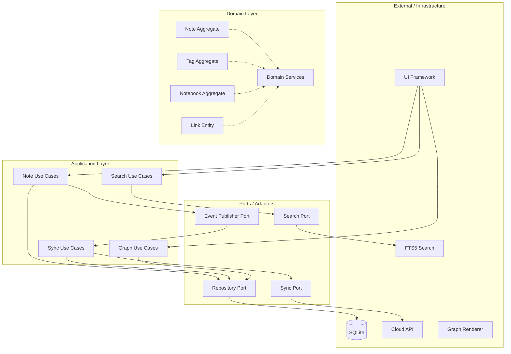
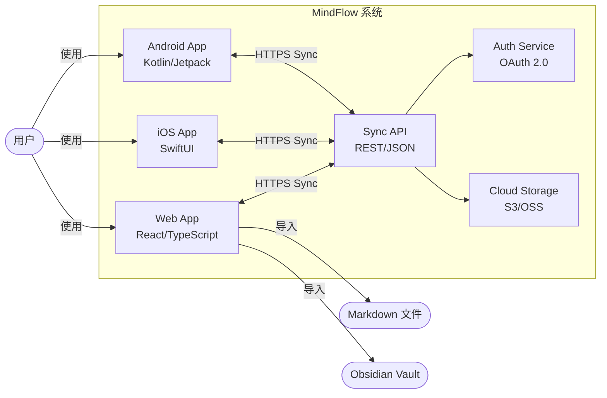
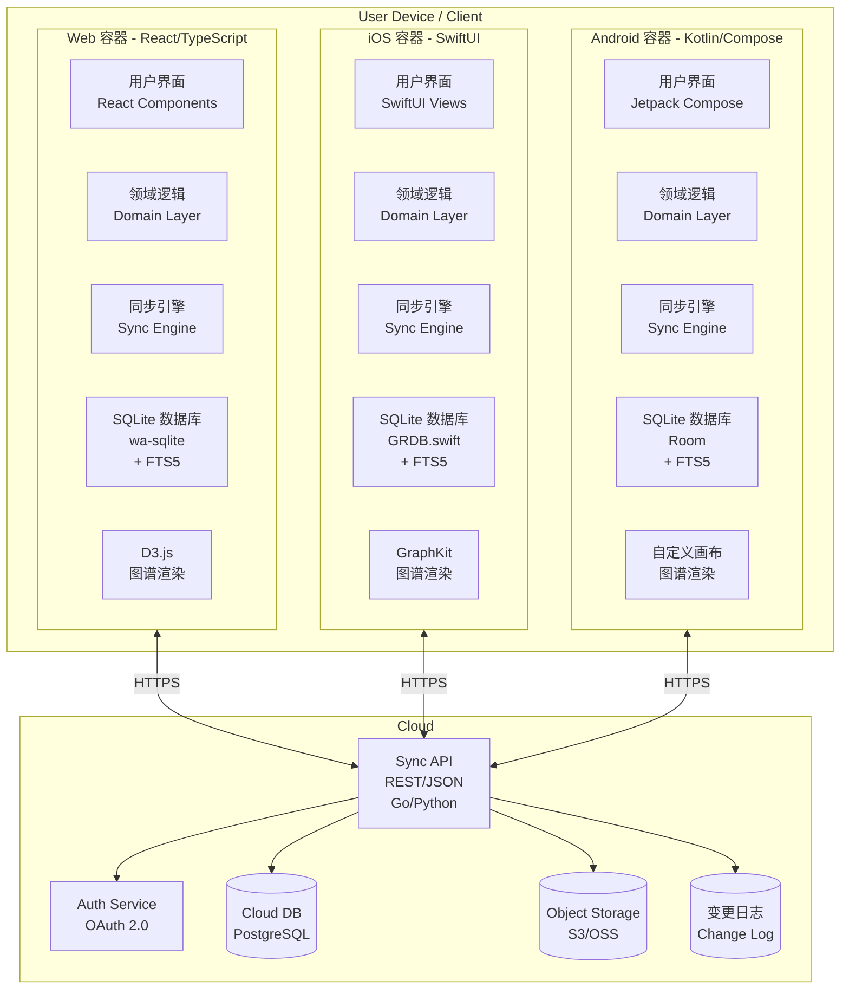
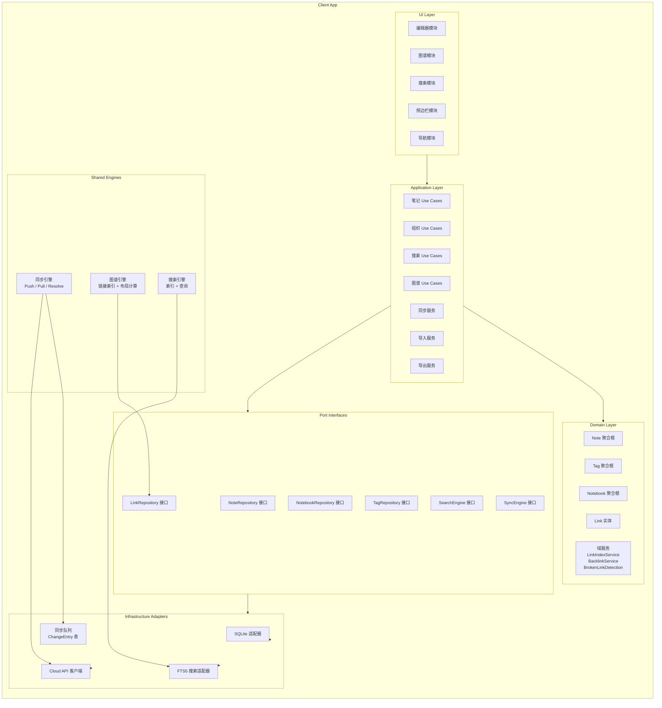
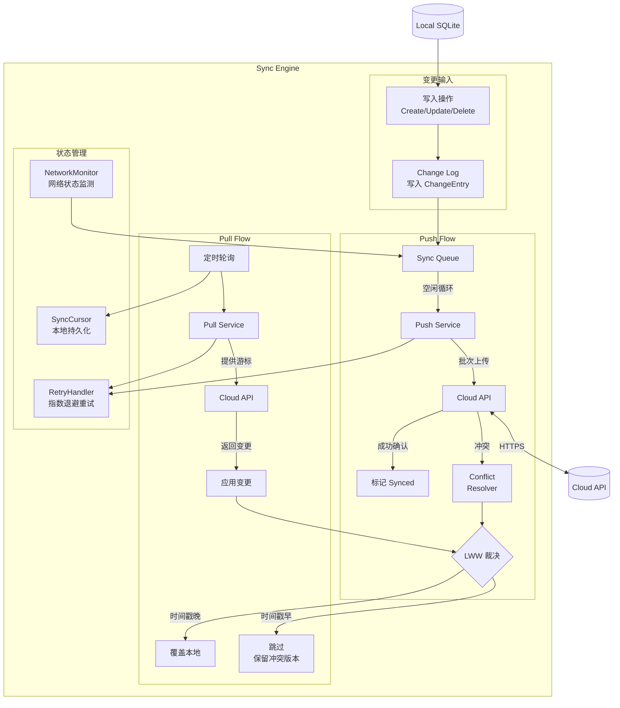
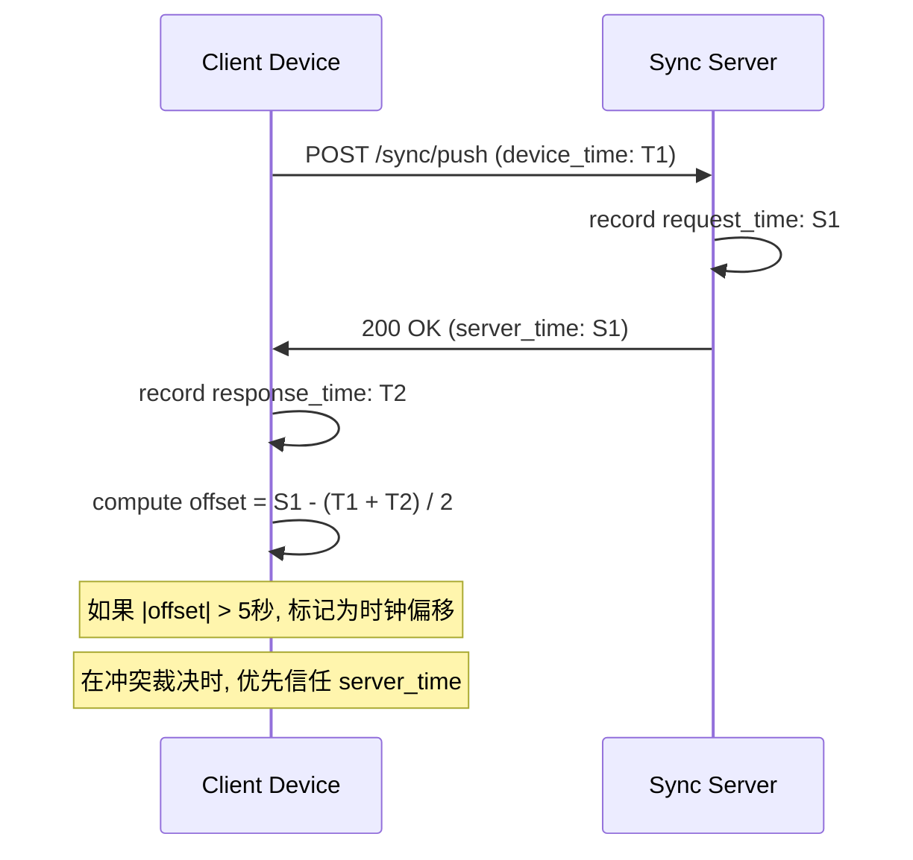

# MindFlow 系统架构总览

**版本**: v0.1
**更新日期**: 2026-07-02
**关联文档**: [PRD](../prd.md) | [用户故事](../user-stories.md) | [功能清单](../feature-list.md)

---

## 目录

1. [领域模型（DDD 视角）](#1-领域模型ddd-视角)
2. [架构风格选型](#2-架构风格选型)
3. [系统架构总览](#3-系统架构总览)
4. [客户端架构设计](#4-客户端架构设计)
5. [同步架构设计](#5-同步架构设计)
6. [云端服务架构](#6-云端服务架构)

---

## 1. 领域模型（DDD 视角）

### 1.1 限界上下文划分

通过对 MindFlow 业务能力的分析，识别出以下 **6 个限界上下文**（Bounded Context）：

| # | 限界上下文 | 核心职责 | 类型 | MVP 包含 |
|---|-----------|---------|------|----------|
| BC-01 | **笔记核心**（Note-taking） | 笔记的创建、编辑、删除、Markdown 解析、自动保存、草稿管理 | **核心域** | 是 |
| BC-02 | **组织系统**（Organization） | 笔记本/文件夹层级管理、层级标签管理、组合筛选 | 支撑域 | 是 |
| BC-03 | **知识图谱**（Knowledge Graph） | 双向链接索引、反向链接管理、断链检测、图谱可视化 | **核心域** | 是 |
| BC-04 | **搜索**（Search） | 全文索引（FTS5）、高级搜索操作符解析、搜索结果排序 | 支撑域 | 是 |
| BC-05 | **同步**（Sync） | Offline-First 变更追踪、LWW 冲突解决、同步队列、增量传输 | **核心域** | 是 |
| BC-06 | **身份与数据管理**（Identity） | 用户认证（OAuth / Email）、密码管理、数据导入导出、账户删除 | 通用域 | 是（P1） |

**不包含的上下文**（明确推迟到后续版本）：
- 团队协作（v2+）
- AI 智能分类（v1.5+）
- Web Clipper（v1.5+）
- 推送通知（P1）

### 1.2 聚合根与实体

#### BC-01: 笔记核心（Note-taking）

```
聚合根: Note
├── NoteId (值对象, UUID)
├── Title (值对象, 字符串, ≤200字符)
├── Content (值对象, Markdown 正文, ≤50000字符)
├── CreatedAt (值对象, ISO-8601 时间戳)
├── UpdatedAt (值对象, ISO-8601 时间戳)
├── DeletedAt (值对象, 可为空, 软删除时间)
├── IsDailyNote (值对象, 布尔, 是否为每日笔记)
├── DeviceId (值对象, 最后修改设备标识)
├── Version (值对象, 单调递增版本号)
├── Checksum (值对象, 内容校验和 SHA-256)
└── 关联引用:
    ├── NotebookId (引用笔记聚合根)
    └── TagPaths[] (值对象集合, 如 ["科技/AI", "待读"])
```

**业务不变条件（Invariants）**：
- 笔记标题不可为空（允许无标题时使用默认日期命名）
- Content 长度 ≤ 50000 字符
- Version 严格单调递增
- 软删除时 DeletedAt 写入，30 天后物理清除

#### BC-02: 组织系统（Organization）

```
聚合根: Notebook (笔记本/文件夹)
├── NotebookId (值对象, UUID)
├── Name (值对象, 字符串, ≤100字符)
├── ParentId (引用同聚合根, 可为空, 自引用树结构)
├── SortOrder (值对象, 整数, 同级排序)
├── CreatedAt (值对象)
└── UpdatedAt (值对象)

聚合根: TagGroup (标签组)
├── TagId (值对象, 标签路径如 "科技/AI")
├── Name (值对象, 末段名称如 "AI")
├── ParentId (引用同聚合根, 可为空)
├── CreatedAt (值对象)
├── UpdatedAt (值对象)
└── SortOrder (值对象)

值对象: TagPath (路径字符串, 如 "科技/AI/大模型")
```

**业务不变条件**：
- Notebook 树深度不限但建议 ≤ 10 层
- 同层 Notebook 名称唯一
- Tag 路径全局唯一（区分大小写）
- 删除父 Notebook 时提供选项：级联删除或子节点提升
- 重命名 Tag 时同步更新所有关联笔记的引用

#### BC-03: 知识图谱（Knowledge Graph）

```
实体: Link (链接索引, 非聚合, 从 Note Content 解析而来)
├── LinkId (值对象, 自增 ID)
├── SourceNoteId (引用 Note 聚合根, 来源笔记)
├── TargetNoteId (引用 Note 聚合根, 可为空, 目标笔记)
├── TargetTitleSnapshot (字符串, 创建链接时的目标标题快照)
├── IsBroken (布尔, 是否为断链)
├── ContextSnippet (字符串, 链接前后各 50 字上下文)
└── CreatedAt (值对象)

值对象: LinkReference (嵌入 Note Content 中的 [[...]] 引用)
├── RawText (原始引用文本)
├── NormalizedTitle (规范化后的标题)
└── Position (在 Content 中的字符偏移)
```

**域服务**:
- `LinkIndexService` — 从 Note Content 解析 `[[...]]` 语法，维护 Link 索引
- `BacklinkQueryService` — 查询指定笔记的所有反向链接
- `BrokenLinkDetectionService` — 检测并标记断链
- `LinkRenameService` — 目标笔记重命名时更新所有引用的标题文字

#### BC-05: 同步（Sync）

```
实体: ChangeEntry (变更记录, 非聚合, 同步队列条目)
├── ChangeId (值对象, 自增 ID)
├── EntityType (值对象, "note" | "notebook" | "tag")
├── EntityId (值对象, 受变更的聚合 ID)
├── Operation (值对象, "create" | "update" | "delete")
├── DeviceId (值对象, 变更发起设备)
├── Timestamp (值对象, ISO-8601 时间戳)
├── Payload (值对象, JSON 序列化的变更数据)
├── Synced (布尔, 是否已上传云端)
├── SyncError (可为空, 最近一次同步错误信息)
└── RetryCount (整数, 重试次数, 累计上限 10 次)

值对象: SyncCursor (同步游标)
├── LastSyncedAt (值对象, 上次成功同步时间)
└── LastChangeId (值对象, 上次成功同步的 Change ID)
```

**域服务**:
- `PushService` — 将本地 ChangeEntry 推送到云端
- `PullService` — 从云端拉取其他设备的 ChangeEntry
- `ConflictResolver` — 基于 LWW 策略裁决冲突
- `ClockSkewDetector` — 检测设备时间偏移并校正

### 1.3 值对象汇总

| 值对象 | 所属上下文 | 说明 |
|--------|-----------|------|
| NoteId | 笔记核心 | UUID v4 |
| Title | 笔记核心 | ≤200 字符，空值自动以日期填充 |
| Content | 笔记核心 | Markdown 正文，≤50000 字符 |
| Timestamp | 全局 | ISO-8601 格式 UTC 时间戳 |
| DeviceId | 全局 | 设备唯一标识，注册时生成 |
| Version | 笔记核心 | 单调递增，用于乐观并发控制 |
| Checksum | 笔记核心 | SHA-256 of title + content |
| TagPath | 组织系统 | 如 "科技/AI"，`/` 分隔层级 |
| SyncCursor | 同步 | 上次同步位置标记 |
| LinkReference | 知识图谱 | `[[链接标题]]` 的解析结果 |

### 1.4 上下文映射（Context Map）

```
┌─────────────────────────────────────────────────────────────────────┐
│                        上下文映射图 (Context Map)                     │
│                                                                     │
│  ┌─────────────────┐       OHS        ┌──────────────────────┐     │
│  │   笔记核心       │◄──────────────────│    组织系统          │     │
│  │   (Note-taking)  │  (笔记本引用端口)  │    (Organization)   │     │
│  └────────┬─────────┘                   └──────────────────────┘     │
│           │                                                          │
│           │ OHS (链接索引端口)                                        │
│           ▼                                                          │
│  ┌─────────────────┐       OHS        ┌──────────────────────┐     │
│  │   知识图谱       │◄──────────────────│    笔记核心          │     │
│  │   (Knowledge     │  (链接更新事件)    │    (Note-taking)     │     │
│  │    Graph)        │                   └──────────────────────┘     │
│  └────────┬─────────┘                                                │
│           │                                                          │
│           │ 共享内核 (Shared Kernel - FTS5 索引 + Link 数据)          │
│           ▼                                                          │
│  ┌─────────────────┐       OHS        ┌──────────────────────┐     │
│  │   搜索           │◄──────────────────│    笔记核心          │     │
│  │   (Search)       │  (内容更新事件)    │    + 知识图谱        │     │
│  └─────────────────┘                   └──────────────────────┘     │
│                                                                     │
│        ACL (防损坏层)                           OHS                  │
│  ┌─────────────────┐       OHS        ┌──────────────────────┐     │
│  │   身份与数据管理   │◄──────────────────│    同步层            │     │
│  │   (Identity)     │  (认证端口)       │    (Sync)            │     │
│  └─────────────────┘                   └────────┬─────────────┘     │
│                                                  │                   │
│                                                  │ 通用协议           │
│                                                  ▼                   │
│                                          ┌──────────────────┐       │
│                                          │   云端服务        │       │
│                                          │   (Cloud API)     │       │
│                                          └──────────────────┘       │
└─────────────────────────────────────────────────────────────────────┘

图例:
OHS  = Open Host Service (开放主机服务) — 通过定义好的端口接口通信
ACL  = Anti-Corruption Layer (防损坏层) — 在模型转换处建立适配
共享内核 = Shared Kernel — 多个上下文共享同一组模型
```

**上下文映射说明**：

| 关系 | 上游 | 下游 | 模式 | 说明 |
|------|------|------|------|------|
| 笔记核心 → 知识图谱 | 笔记核心 | 知识图谱 | OHS | 笔记保存后触发链接索引重建 |
| 笔记核心 → 组织系统 | 组织系统 | 笔记核心 | OHS | 笔记引用 NotebookId 和 TagPath |
| 笔记核心 + 知识图谱 → 搜索 | 笔记核心/知识图谱 | 搜索 | 共享内核 | 搜索模块直接读取笔记和链接数据构建 FTS5 索引 |
| 笔记核心 → 同步 | 笔记核心 | 同步 | OHS | 笔记变更事件触发 ChangeEntry 记录 |
| 同步 → 云端服务 | 同步 | 云端 | 通用协议 | REST + JSON 变更协议 |
| 身份 → 同步 | 身份 | 同步 | OHS | 同步层通过认证端口获取用户身份 |

### 1.5 核心实体关系图（ER 图）

```mermaid
erDiagram
    Note ||--o{ NoteTag : has
    NoteTag }o--|| Tag : references
    Note ||--o{ Link : source
    Note ||--o{ Link : target
    Note }o--|| Notebook : belongs_to
    Notebook ||--o{ Notebook : parent

    Note {
        string id UUID PK
        string title
        string content Markdown
        string notebook_id FK nullable
        boolean is_daily_note
        boolean is_deleted
        string created_at ISO-8601
        string updated_at ISO-8601
        string deleted_at nullable
        string device_id
        int version
        string checksum SHA-256
    }

    Notebook {
        string id UUID PK
        string name
        string parent_id FK nullable
        int sort_order
        string created_at
        string updated_at
    }

    Tag {
        string id "tag_path e.g. 科技/AI" PK
        string name "last segment"
        string parent_id FK nullable
        string created_at
        string updated_at
        int sort_order
    }

    NoteTag {
        string note_id FK
        string tag_id FK
    }

    Link {
        int id PK autoincrement
        string source_note_id FK
        string target_note_id FK nullable
        string target_title_snapshot
        boolean is_broken
        string context_snippet
        string created_at
    }

    ChangeEntry {
        int id PK autoincrement
        string entity_type "note|notebook|tag"
        string entity_id
        string operation "create|update|delete"
        string device_id
        string timestamp
        string payload JSON
        boolean synced
        string sync_error nullable
        int retry_count
    }
```

---

## 2. 架构风格选型

### 2.1 推荐模式：六边形架构（Hexagonal Architecture / Ports & Adapters）

**核心选择依据**：

| 约束 | 六边形架构如何满足 |
|------|------------------|
| Offline-First | 业务逻辑完全独立于网络适配器，离线时所有端口照常工作 |
| 多端原生开发 | 每端实现相同的 Port 接口，Domain 设计共享，Infrastructure 各自适配 |
| SQLite 本地存储 | 存储端口定义 Repository 接口，SQLite 是实现适配器之一 |
| 同步引擎隔离 | 同步作为 Hexagon 外部的适配器，通过 Domain Events 和 Repository Port 交互 |
| 可测试性 | 端口接口可 mock，Domain 逻辑可以在不依赖基础设施的情况下单元测试 |

### 2.2 各层定义



### 2.3 分层职责

| 层级 | 职责 | 依赖方向 | 允许导入 |
|------|------|---------|---------|
| **领域层**（Domain） | 聚合根、实体、值对象、域服务、Repository 接口定义 | 无外部依赖 | 仅标准库 |
| **应用层**（Application） | Use Case 编排、事务协调、授权检查、事件发布 | 向内依赖领域层 | 领域层接口、事件定义 |
| **端口层**（Ports） | Repository、Search、Sync 等接口定义 | 与领域层同级 | 领域层值对象 |
| **适配器层**（Infrastructure） | SQLite 实现、REST 客户端、FTS5 实现、同步队列 | 向外实现端口 | 端口接口、第三方库 |

### 2.4 为什么不选择其他模式

| 模式 | 不选择理由 |
|------|-----------|
| **经典分层架构** | 各层之间耦合紧密，难以在 Offline-First 场景中隔离存储和网络依赖 |
| **洋葱架构** | 与六边形架构本质相同，但六边形架构对多适配器场景的表述更直观 |
| **CQRS** | 读/写分离度不足以证明全量 CQRS 的复杂度；本地 SQLite 已同时承担读/写 |
| **事件驱动架构** | 单进程客户端中的事件总线收益有限，同步层的事件队列更轻量 |
| **微服务** | 个人应用的部署规模与同步延迟约束决定不适合分布式拆分 |

### 2.5 适度引入的局部模式

虽然不采用全量 CQRS 或事件驱动架构，但在以下**局部**引入模式：

1. **同步层的变更事件日志** — 一种轻量级 Event Sourcing，将每次变更记录为 ChangeEntry，作为同步的基础数据单元
2. **搜索的读模型分离** — 搜索读取 FTS5 虚拟表而非直接查询 notes 表，实现有限的 CQRS 模式
3. **图谱的数据摘要层** — Graph 模块维护独立的 Link 索引表，作为 Note Content 的投影（Projection）

---

## 3. 系统架构总览

### 3.1 C4 上下文图（Context Diagram）



### 3.2 C4 容器图（Container Diagram）



---

## 4. 客户端架构设计

### 4.1 模块分解（通用结构，各端独立实现）

以下结构适用于 Web/iOS/Android 三端，各端使用对应语言和框架实现相同职责的模块。



### 4.2 各平台技术选型

| 模块 | Web (React/TypeScript) | iOS (SwiftUI/Swift) | Android (Kotlin/Compose) |
|------|----------------------|---------------------|-------------------------|
| 存储适配器 | wa-sqlite (WebAssembly SQLite) | GRDB.swift | Room |
| 全文搜索 | SQLite FTS5 (wa-sqlite) | SQLite FTS5 (GRDB) | SQLite FTS5 (Room) |
| Markdown 解析 | unified/remark + rehype | Down / SwiftMarkdown | Markwon |
| 图谱渲染 | D3.js Force Simulation | GraphKit / SceneKit | 自定义 Canvas / GraphView 封装 |
| HTTP 客户端 | fetch / axios | URLSession | OkHttp / Retrofit |
| 编辑器 | CodeMirror / Slate + 自定义 | UITextView / TextKit 2 | EditText / Markwon Editor |
| 状态管理 | Zustand / React State | ObservableObject / @Published | StateFlow / MutableState |
| 加密存储 | Web Crypto API | Keychain / CryptoKit | EncryptedSharedPreferences |
| 认证 | OAuth 2.0 PKCE | ASWebAuthenticationSession | Chrome Custom Tabs OAuth |
| 同步协议 | REST + JSON | REST + JSON | REST + JSON |

### 4.3 包/模块结构建议

**Web 端（React/TypeScript）**：

```
src/
├── domain/
│   ├── note/              # Note 聚合根、值对象、域事件
│   ├── notebook/          # Notebook 聚合根
│   ├── tag/               # Tag 聚合根
│   ├── link/              # Link 实体
│   └── services/          # 域服务（LinkIndexService 等）
├── application/
│   ├── use-cases/         # 应用服务（CreateNote, RenameNotebook...）
│   ├── sync/              # 同步引擎（PushService, PullService, ConflictResolver）
│   └── search/            # 搜索应用服务
├── ports/
│   ├── repository.ts      # 仓储接口定义
│   ├── search-engine.ts   # 搜索引擎接口
│   └── sync-engine.ts     # 同步引擎接口
├── infrastructure/
│   ├── sqlite/            # wa-sqlite 适配器
│   ├── api/               # Cloud API REST 客户端
│   ├── fts5/              # FTS5 搜索适配器
│   └── crypto/            # 校验和计算
├── ui/
│   ├── editor/            # Markdown 编辑器组件
│   ├── graph/             # 知识图谱 D3.js 组件
│   ├── search/            # 搜索 UI 组件
│   ├── sidebar/           # 侧边栏导航
│   ├── components/        # 通用 UI 组件
│   └── pages/             # 页面容器
└── store/                 # 全局状态管理
```

**iOS 端（Swift/SwiftUI）**：

```
MindFlow/
├── Domain/
│   ├── Note/
│   ├── Notebook/
│   ├── Tag/
│   ├── Link/
│   └── Services/
├── Application/
│   ├── UseCases/
│   ├── Sync/
│   └── Search/
├── Ports/
├── Infrastructure/
│   ├── Storage/           # GRDB.swift
│   ├── API/
│   ├── FTS5/
│   └── Crypto/
└── UI/
    ├── Editor/
    ├── Graph/
    ├── Search/
    ├── Sidebar/
    └── Components/
```

**Android 端（Kotlin/Jetpack Compose）**：

```
app/src/main/java/com/mindflow/
├── domain/
│   ├── note/
│   ├── notebook/
│   ├── tag/
│   ├── link/
│   └── services/
├── application/
│   ├── usecase/
│   ├── sync/
│   └── search/
├── ports/
├── infrastructure/
│   ├── storage/           # Room DAO
│   ├── api/               # Retrofit
│   ├── fts5/
│   └── crypto/
└── ui/
    ├── editor/
    ├── graph/
    ├── search/
    ├── sidebar/
    └── components/
```

---

## 5. 同步架构设计

### 5.1 同步引擎架构



### 5.2 同步协议定义

**Push 请求**：

```json
POST /v1/sync/push
Authorization: Bearer <token>
Content-Type: application/json

{
  "device_id": "device-uuid-xxx",
  "since_cursor": {
    "last_synced_at": "2026-07-01T12:00:00Z",
    "last_change_id": 1289
  },
  "changes": [
    {
      "change_id": 1290,
      "entity_type": "note",
      "entity_id": "note-uuid-abc",
      "operation": "update",
      "timestamp": "2026-07-02T10:30:00Z",
      "device_id": "device-uuid-xxx",
      "payload": {
        "title": "新标题",
        "content": "修改后的正文...",
        "checksum": "sha256-hash...",
        "version": 5
      }
    }
  ],
  "device_time": "2026-07-02T10:30:05Z"
}
```

**Push 响应**：

```json
HTTP/1.1 200 OK
Content-Type: application/json

{
  "cursor": {
    "server_time": "2026-07-02T10:30:06Z",
    "acknowledged_change_ids": [1290],
    "last_change_id": 1290
  },
  "conflicts": [],
  "pending_changes_count": 5
}
```

**Pull 请求**：

```json
POST /v1/sync/pull
Authorization: Bearer <token>

{
  "device_id": "device-uuid-yyy",
  "cursor": {
    "last_change_id": 1200,
    "last_synced_at": "2026-07-02T08:00:00Z"
  },
  "limit": 100,
  "device_time": "2026-07-02T10:31:00Z"
}
```

### 5.3 时钟偏移处理

同步协议中的 `device_time` 和 `server_time` 配对用于检测和校正设备时钟偏移：



时钟偏移下的冲突规则：
- 如果 |本地时间 - 服务器时间| < 5 秒：使用本地时间戳进行 LWW 裁决
- 如果 |本地时间 - 服务器时间| >= 5 秒：标记冲突，以服务端收到请求的时间戳为准
- 连续 3 次检测到时钟偏移：提示用户校准设备时间

### 5.4 同步队列可靠性

| 场景 | 处理方式 |
|------|---------|
| App 崩溃时变更未同步 | ChangeEntry 写入 SQLite 持久化队列，重启后继续处理 |
| 网络中断 | 指数退避重试（5s → 15s → 45s → 2min → 5min），上限 5min |
| 连续失败 10 次 | 标记 Error，不再自动重试，需用户手动触发 |
| 离线编辑队列堆积 | Pull 请求优先于 Push 请求（先获取远端最新状态再推送本地变更） |
| 同步冲突 | LWW 裁决 + 冲突版本保留在版本历史中，不丢失数据 |

---

## 6. 云端服务架构

### 6.1 云端服务职责

| 服务 | 职责 | 技术选型（建议） |
|------|------|----------------|
| **Sync API** | 处理同步 Push/Pull 请求、变更日志存储、冲突辅助裁决 | Go / FastAPI + PostgreSQL |
| **Auth Service** | OAuth 2.0 认证（Google/Apple/Email）、Token 管理、会话维护 | Auth0 / Firebase Auth / 自建 |
| **Object Storage** | 附件存储、备份存储 | AWS S3 / Cloudflare R2 / 阿里云 OSS |
| **Change Log DB** | 持久化存储所有用户变更日志 | PostgreSQL |
| **User DB** | 用户账户、订阅信息 | PostgreSQL |

### 6.2 云端数据模型（简化）

```sql
-- 用户账户
CREATE TABLE users (
    id UUID PRIMARY KEY,
    email TEXT UNIQUE,
    auth_provider TEXT NOT NULL,         -- 'google' | 'apple' | 'email'
    auth_provider_id TEXT UNIQUE,
    password_hash TEXT,                  -- email 注册时使用
    created_at TIMESTAMPTZ NOT NULL,
    deleted_at TIMESTAMPTZ,              -- 30天软删除
    subscription_tier TEXT DEFAULT 'free' -- 'free' | 'pro'
);

-- 设备注册
CREATE TABLE devices (
    id UUID PRIMARY KEY,
    user_id UUID NOT NULL REFERENCES users(id),
    device_name TEXT NOT NULL,
    platform TEXT NOT NULL,               -- 'web' | 'ios' | 'android'
    last_seen_at TIMESTAMPTZ NOT NULL,
    created_at TIMESTAMPTZ NOT NULL
);

-- 全局变更日志（所有用户的变更集中存储）
CREATE TABLE change_log (
    id BIGSERIAL PRIMARY KEY,
    user_id UUID NOT NULL REFERENCES users(id),
    device_id UUID NOT NULL,
    entity_type TEXT NOT NULL,             -- 'note' | 'notebook' | 'tag'
    entity_id UUID NOT NULL,
    operation TEXT NOT NULL,               -- 'create' | 'update' | 'delete'
    timestamp TIMESTAMPTZ NOT NULL,
    version INT NOT NULL,
    checksum TEXT,
    payload JSONB NOT NULL,               -- 变更内容的 JSON 快照
    server_timestamp TIMESTAMPTZ NOT NULL DEFAULT NOW(),
    INDEX idx_user_timestamp (user_id, timestamp)
);

-- 笔记快照（用于版本历史和冲突还原）
CREATE TABLE note_snapshots (
    id BIGSERIAL PRIMARY KEY,
    note_id UUID NOT NULL,
    user_id UUID NOT NULL REFERENCES users(id),
    version INT NOT NULL,
    title TEXT NOT NULL,
    content TEXT NOT NULL,
    checksum TEXT NOT NULL,
    created_by_device UUID NOT NULL,
    captured_at TIMESTAMPTZ NOT NULL,     -- 快照捕获时间（服务端时间）
    UNIQUE(note_id, version)
);
```

---

## 7. 与 PRD 约束的符合性检查

| PRD 约束 | 架构方案中的体现 |
|----------|----------------|
| Offline-First 本地真理源 | 六边形架构确保 Domain 不依赖网络；本地 SQLite 为首要存储 |
| Web 优先 iOS 跟进 Android 追赶 | 三端独立实现相同架构，Web 开发效率最高可先行验证 |
| 各端原生开发，不跨平台 | 三端各有一套架构但遵循相同的 Port/Domain 设计 |
| 单用户 10000+ 条笔记 | SQLite FTS5 已验证在 5000+ 笔记时搜索 < 500ms；分页、惰性加载 |
| P95 同步延迟 < 3s | 增量同步、轻量 ChangeEntry、同步队列空闲循环 |
| 离线全部核心功能可用 | 域逻辑全在本地、Repository Port 由本地 SQLite 适配器实现 |
| LWW 冲突策略 | ConflictResolver 域服务实现 LWW 裁决 |
| 无多人协作 | 同步协议只处理单用户多设备场景 |
