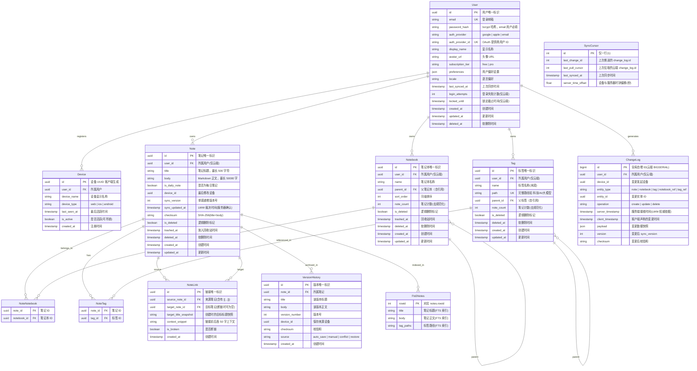

# ER 图：MindFlow 个人知识管理系统

## 实体关系总览

---

## 逐表说明

### User — 用户账户

核心字段：

| 字段 | 类型 | 长度 | 必填 | 默认值 | 说明 |
|------|------|------|------|--------|------|
| id | UUID | 16 | Y | gen_random_uuid() | 主键 |
| email | VARCHAR | 320 | Y | - | 登录邮箱，用户唯一标识 |
| password_hash | VARCHAR | 255 | N | - | bcrypt 哈希，Email 注册时必填 |
| auth_provider | VARCHAR | 20 | Y | 'email' | 认证方式枚举 |
| preferences | JSONB | - | Y | '{}' | 用户偏好设置 |
| subscription_tier | VARCHAR | 20 | Y | 'free' | 订阅层级 |

生命周期：`注册 → 活跃 → 注销(30天软删除) → 物理删除`

关联关系：

| 目标实体 | 关系 | 外键 | 说明 |
|----------|------|------|------|
| Device | 一对多 | user_id | 用户可注册多台设备 |
| Note | 一对多 | user_id | 用户拥有多条笔记 |
| Notebook | 一对多 | user_id | 用户创建多个笔记本 |
| Tag | 一对多 | user_id | 用户创建多个标签 |
| ChangeLog | 一对多 | user_id | 用户产生若干变更记录 |

---

### Note — 笔记

核心字段：

| 字段 | 类型 | 长度 | 必填 | 默认值 | 说明 |
|------|------|------|------|--------|------|
| id | UUID | 16 | Y | 客户端生成 | 主键 |
| title | VARCHAR | 500 | Y | '' | 笔记标题 |
| body | TEXT | 无上限 | Y | '' | Markdown 正文，应用层限制 50000 字 |
| sync_version | INTEGER | 4 | Y | 1 | 版本号，每次保存递增 |
| sync_updated_at | TIMESTAMPTZ | 8 | Y | NOW() | LWW 冲突裁决时间 |
| checksum | VARCHAR | 64 | Y | '' | SHA-256 内容校验 |
| is_daily_note | BOOLEAN | 1 | Y | false | 每日笔记标记 |

生命周期：`编辑中 → 已保存 → 回收站(trashed_at设值) → 30天后软删除(deleted_at设值) → 物理清理`

关联关系：

| 目标实体 | 关系 | 外键 | 说明 |
|----------|------|------|------|
| Notebook | 多对多 | note_notebooks | 一条笔记可属于多个笔记本 |
| Tag | 多对多 | note_tags | 一条笔记可有多个标签 |
| NoteLink | 一对多(source) | source_note_id | 笔记中创建的 `[[链接]]` |
| NoteLink | 一对多(target) | target_note_id | 被其他笔记引用 |
| VersionHistory | 一对多 | note_id | 版本历史快照 |
| Fts5Notes | 一对一 | rowid | 全文搜索索引 |

**设计决策：不直接将 notebook_id 作为 Note 字段，而是通过多对多关联表实现「一条笔记可属于多个笔记本」的需求。**

---

### Notebook — 笔记本/文件夹

核心字段：

| 字段 | 类型 | 长度 | 必填 | 默认值 | 说明 |
|------|------|------|------|--------|------|
| id | UUID | 16 | Y | gen_random_uuid() | 主键 |
| name | VARCHAR | 200 | Y | - | 笔记本名称 |
| parent_id | UUID | 16 | N | NULL | 父文件夹，NULL 为根节点 |
| sort_order | INTEGER | 4 | Y | 0 | 同级文件夹排序 |
| note_count | INTEGER | 4 | Y | 0 | 去规范化笔记数 |

生命周期：`创建 → 使用中 → 回收站 → 软删除 → 物理清理`

关联关系：

| 目标实体 | 关系 | 外键 | 说明 |
|----------|------|------|------|
| Note | 多对多 | note_notebooks | 笔记本包含多条笔记 |
| Notebook (parent) | 一对多(自引用) | parent_id | 树状层级结构 |

---

### Tag — 层级标签

核心字段：

| 字段 | 类型 | 长度 | 必填 | 默认值 | 说明 |
|------|------|------|------|--------|------|
| id | UUID | 16 | Y | gen_random_uuid() | 主键 |
| name | VARCHAR | 100 | Y | - | 末段标签名，如 "大模型" |
| path | VARCHAR | 500 | Y | - | 完整路径，如 "科技/AI/大模型" |
| parent_id | UUID | 16 | N | NULL | 父标签 |
| note_count | INTEGER | 4 | Y | 0 | 去规范化计数 |

**设计决策：使用路径字符串而非纯 parent_id 层级，优点：**
- 单字段即可查询所有子标签（`path LIKE '科技/AI/%'`）
- 导入时可直接构造，无需递归查找父级
- 标签重命名只需更新 path 字段

生命周期：`创建 → 使用中 → 合并/重命名 → 软删除 → 物理清理`

关联关系：

| 目标实体 | 关系 | 外键 | 说明 |
|----------|------|------|------|
| Note | 多对多 | note_tags | 标签可绑多条笔记 |
| Tag (parent) | 一对多(自引用) | parent_id | 层级结构 |

---

### NoteLink — 双向链接

核心字段：

| 字段 | 类型 | 长度 | 必填 | 默认值 | 说明 |
|------|------|------|------|--------|------|
| id | UUID | 16 | Y | gen_random_uuid() | 主键 |
| source_note_id | UUID | 16 | Y | - | 含有 `[[...]]` 的笔记 |
| target_note_id | UUID | 16 | N | NULL | 被引用笔记（NULL = 断链） |
| target_title_snapshot | VARCHAR | 500 | Y | - | 记录引用时的目标标题 |
| is_broken | BOOLEAN | 1 | Y | false | 目标删除/重命名后标记为 true |
| context_snippet | TEXT | - | N | '' | 链接上下文片段 |

数据维护：
- **创建**：笔记保存时解析 body 中的 `[[...]]` 语法，提取所有链接
- **更新**：全量删除来源笔记的所有链接，重新解析 body 写入
- **重命名**：目标笔记重命名后，遍历所有 `target_title_snapshot == old_title` 的链接，更新为 new_title
- **断链检测**：目标笔记被软删除后，所有指向它的链接 `is_broken = true`
- **恢复**：目标笔记从回收站恢复后，所有 `is_broken` 链接重新匹配目标

---

### ChangeLog — 同步变更日志

核心字段：

| 字段 | 类型 | 长度 | 必填 | 默认值 | 说明 |
|------|------|------|------|--------|------|
| id | BIGSERIAL (云端) / INTEGER AUTOINCREMENT (本地) | 8 | Y | 自增 | 同步排序依据 |
| entity_type | VARCHAR | 20 | Y | - | 受变更实体类型 |
| operation | VARCHAR | 10 | Y | - | create / update / delete |
| server_timestamp | TIMESTAMPTZ | 8 | Y | NOW() | 服务端接收时间（LWW 权威裁决） |
| client_timestamp | TIMESTAMPTZ | 8 | Y | - | 客户端声称时间 |
| payload | JSONB / TEXT | - | Y | - | 变更数据的完整快照 |
| version | INTEGER | 4 | Y | - | 变更后版本号 |

**本地与云端差异**：

| 维度 | 本地 SQLite change_log | 云端 PostgreSQL change_log |
|------|----------------------|--------------------------|
| 范围 | 单设备变更 | 用户所有设备的变更汇集 |
| 主键 | INTEGER AUTOINCREMENT | BIGSERIAL 全局递增 |
| 是否清空 | 标记 `synced=1` 保留（用于冲突排查） | 90 天后清理 |
| 包含字段 | 额外 `synced, sync_error, retry_count` | 无（由 Push 流程管理状态） |

---

### VersionHistory — 版本历史

核心字段：

| 字段 | 类型 | 长度 | 必填 | 默认值 | 说明 |
|------|------|------|------|--------|------|
| id | UUID | 16 | Y | gen_random_uuid() | 主键 |
| note_id | UUID | 16 | Y | - | 所属笔记 |
| title | VARCHAR | 500 | Y | - | 该版本标题 |
| body | TEXT | - | Y | - | 该版本正文 |
| version_number | INTEGER | 4 | Y | - | 版本号，每笔记内递增 |
| source | VARCHAR | 20 | Y | 'auto_save' | 版本来源 |

保留策略：
- 每笔记最多 30 个版本
- 超限时删除最旧版本
- 冲突覆盖版本也会进入版本历史
- 版本历史存储在本地 + 云端

---

### SyncCursor — 同步游标

核心字段：

| 字段 | 类型 | 长度 | 必填 | 默认值 | 说明 |
|------|------|------|------|--------|------|
| id | INTEGER | 4 | Y | 1 | 仅一行存在 |
| last_change_id | INTEGER | 4 | Y | 0 | 上次成功推送的本地 change_log.id |
| last_pull_cursor | INTEGER | 4 | Y | 0 | 上次成功拉取的云端 change_log.id |
| server_time_offset | REAL | 8 | Y | 0.0 | 时钟偏移量（秒） |

这是本地专用的单行表，云端不需要单独的表（通过 `change_log.id` 和 `devices.last_seen_at` 推算）。

---

## 数据量预估

| 实体 | 初始规模 | 年增长 | 3年后 | 热度 |
|------|----------|--------|-------|------|
| notes | 100 条/用户 | 500-1000 条 | ~3000 | 热 |
| notebooks | 10 个/用户 | 20-50 个 | ~150 | 温 |
| tags | 20 个/用户 | 50-100 个 | ~300 | 温 |
| note_links | 50 条 | 500-2000 条 | ~6000 | 温 |
| note_tags | 200 条 | 1000-2000 条 | ~6000 | 温 |
| version_history | 1000 条 (30版本 × ~33笔记) | 15000-30000 条 | ~90000 | 冷 |
| change_log | 5000 条/用户/年 | 36000-72000 条 | ~200000 | 温 |
| devices | 2-3 台/用户 | 3-5 台 | ~5 | 冷 |

---

## 关键查询路径

| 查询 | SQL 概要 | 涉及表 | 预期频率 |
|------|----------|--------|----------|
| 笔记列表（最近修改） | `WHERE deleted_at IS NULL ORDER BY updated_at DESC LIMIT 50` | notes | 极高（每次打开 App） |
| 笔记本树 | `WHERE parent_id IS NULL OR parent_id=? ORDER BY sort_order` | notebooks | 高（侧边栏展开） |
| `[[` 联想 | `WHERE title LIKE '%keyword%' AND deleted_at IS NULL ORDER BY updated_at DESC LIMIT 10` | notes | 中（编辑时触发） |
| `#` 标签联想 | `WHERE path LIKE '%keyword%' AND deleted_at IS NULL ORDER BY note_count DESC LIMIT 10` | tags | 中（编辑时触发） |
| 反向链接 | `WHERE target_note_id=? AND is_broken=0 ORDER BY created_at DESC` | note_links | 中（笔记详情页） |
| 全文搜索 | FTS5 MATCH 查询 + JOIN notes | fts5_notes, notes | 高（搜索时） |
| 按笔记本过滤 | `JOIN note_notebooks ON ... WHERE notebook_id=?` | notes, note_notebooks | 高（侧边栏点击） |
| 按标签过滤 | `JOIN note_tags ON ... WHERE tag_id=? OR path LIKE 'prefix/%'` | notes, note_tags, tags | 高（标签筛选时） |
| 增量同步推送 | `WHERE synced=0 ORDER BY id LIMIT 50` | change_log (本地) | 高（每 3 秒） |
| 增量同步拉取 | `WHERE user_id=? AND id > ? ORDER BY id LIMIT 100` | change_log (云端) | 高（每 3 秒） |
| 版本历史 | `WHERE note_id=? ORDER BY version_number DESC LIMIT 30` | version_history | 低（用户主动查看） |
| 断链检测 | `WHERE is_broken=1` | note_links | 低（每次笔记操作后增量） |
| 回收站列表 | `WHERE trashed_at IS NOT NULL ORDER BY trashed_at DESC` | notes | 低（用户进入回收站） |
