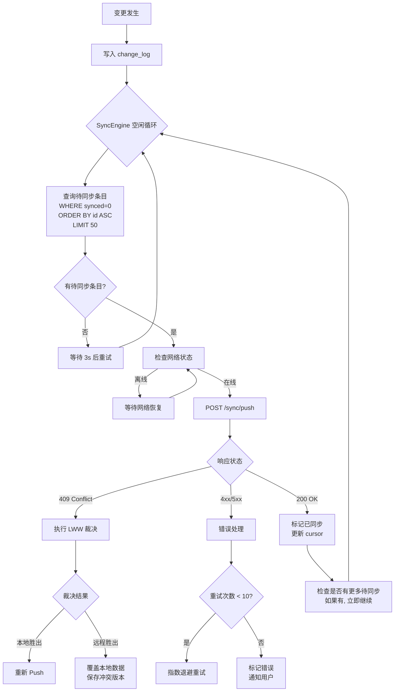

# ADR-0002: Offline-First 同步架构

## 状态

**已接受**

## 上下文

MindFlow 需要在 Web/iOS/Android 三端之间实现笔记数据的同步。基于 PRD 的约束：

- **Offline-First**：本地 SQLite 是真理源，离线操作必须完全可用
- **同步延迟 P95 < 3s**：一端保存后，另一端在 3 秒内看到变更
- **LWW 冲突策略**：MVP 使用 Last-Writer-Wins 处理编辑冲突
- **增量同步**：仅传输变更部分，而非全量数据
- **弱网友好**：网络故障时不弹错误，自动后台重试

核心问题：

1. **同步引擎的位置**：同步引擎应该在客户端还是服务端？职责边界在哪？
2. **同步触发机制**：每次保存后立即同步 vs 定时轮询 vs 长连接推送？
3. **变更数据单元**：以什么粒度传输变更（整条笔记 vs 字段级别）？
4. **同步方向**：只推送本地变更 + 拉取远程变更（双向 pull/push），还是服务端推送？
5. **首次全量同步**：新设备或重装 App 后如何快速获取全量数据？
6. **重试与幂等**：重复的变更请求如何保证幂等？

## 决策

### 决策 1：客户端驱动的同步引擎（Client-Driven Sync）

**同步引擎完全运行在客户端**，每个设备独立运行自己的同步循环。

- 客户端负责：变更追踪、同步队列管理、网络监测、Push 请求发送、Pull 请求发起、冲突裁决
- 云端负责：接收变更写入日志、存储变更条目、按需返回变更查询结果、返回服务端时间戳
- 云端是被动的数据存储层，不主动推送变更（不使用 WebSocket、长连接等推送机制）

**理由**：
- Offline-First 决定了客户端必须掌控同步节奏（离线时暂停，联网后恢复）
- 云端无业务逻辑，降低了云端架构复杂度
- 客户端可以根据当前网络情况动态调整同步策略（WiFi 优先、节流等）

### 决策 2：基于 ChangeLog 的增量同步

**每次数据变更（Note/Notebook/Tag 的 Create/Update/Delete）都记录为一条 ChangeEntry 到本地 `change_log` 表**。

```
变更发生 → 写入本地业务表 → 写入 change_log → 同步引擎拾取 → 推送到云端
```

- 变更单元：整条 Aggregate（整篇笔记，而非字段级别）
- 同步粒度：每次同步传输一组 ChangeEntry（批次上限 50 条 Push / 100 条 Pull）
- 云端 ChangeLog 全局递增：云端维护全局唯一的 `change_id`（BIGSERIAL），Pull 请求基于此游标

### 决策 3：定时轮询 + 事件触发混合模式

同步引擎使用两种触发模式协同工作：

| 模式 | 触发条件 | 行为 | 说明 |
|------|---------|------|------|
| **事件触发** | 本地变更保存后 | 立即尝试 Push | 保证低延迟（P95 < 3s） |
| **空闲轮询** | 后台 3 秒间隔循环 | 检查待同步条目 + Pull 远程变更 | 保证可靠性（不漏掉任何变更） |
| **网络恢复** | 从离线切换到在线 | 立即触发一次完整 Push + Pull | 处理离线累积的变更 |
| **强制触发** | 用户手动点击同步按钮 | 立即同步 | 应急入口，极少使用 |

**不使用 WebSocket/长连接推送的理由**：
- MVP 阶段云端复杂度目标尽可能低
- 定时轮询 3s 间隔已满足 P95 < 3s 的延迟要求
- 消除长连接引入的状态管理、重连、心跳等复杂度
- WebSocket 推送可作为后续优化引入（v1.5+）

### 决策 4：同步协议基于 REST + JSON

同步协议使用 REST API，基于 JSON 序列化，而不是 gRPC 或 GraphQL。

| 协议 | 选用理由 | 不选用理由 |
|------|---------|-----------|
| **REST + JSON (选用)** | 三端 HTTP 客户端天然支持；调试简单（curl）；schema 简单清晰 | — |
| gRPC | — | 搭建和维护 Service Mesh 的开销对 MVP 过大；Android 支持好但 Web 端需 gRPC-Web 桥接，增加复杂度 |
| GraphQL | — | 同步场景的查询模式非常固定（Push 和 Pull 各一个端点），GraphQL 的灵活查询能力在此场景没有收益 |

### 决策 5：增量传输，基于版本号合并

**Push 方向**：客户端将本地 ChangeEntry 发送到云端。云端检查每个 ChangeEntry 的 `entity_id + version` 组合：

- 如果远程版本 < 本地版本 → 接受变更（记录新 ChangeEntry，version 取服务端版号）
- 如果远程版本 >= 本地版本 + 1 → 标记为冲突，返回远程版本供客户端裁决
- 如果远程版本 = 本地版本 → 重复操作，返回成功（幂等）

**Pull 方向**：客户端请求 `since_cursor`（上次同步位置）之后的全部变更。云端查询 `change_log` 表，返回增量条目。

**增量传输的关键设计**：

```
Push 请求体示例:
{
  "device_id": "uuid-device-a",
  "since_cursor": { "last_change_id": 1289, "last_synced_at": "..." },
  "changes": [
    {
      "entity_type": "note",
      "entity_id": "uuid-note-abc",
      "operation": "update",
      "version": 5,
      "timestamp": "2026-07-02T10:30:00Z",
      "payload": { "title": "...", "content": "...", "checksum": "sha256..." }
    }
  ]
}

Push 响应体示例 (正常):
{
  "cursor": { "last_change_id": 1290, "server_time": "2026-07-02T10:30:06Z" },
  "conflicts": [],
  "pending_changes_count": 3
}

Push 响应体示例 (冲突):
{
  "cursor": { "last_change_id": 1290, "server_time": "..." },
  "conflicts": [
    {
      "entity_id": "uuid-note-abc",
      "entity_type": "note",
      "local_version": 5,
      "remote_version": 6,
      "remote_payload": { ... },
      "remote_timestamp": "...",
      "remote_device_id": "uuid-device-b"
    }
  ]
}
```

### 决策 6：首次全量同步采用分批拉取

新设备或重装 App 后的首次同步：

1. 注册设备标识（在云端注册新的 `device_id`）
2. 调用 `GET /v1/sync/full?limit=200&offset=0` 批量拉取用户的所有笔记、笔记本、标签数据
3. 分批写入本地 SQLite（每批 200 条）
4. 拉取完成后构建本地 FTS5 索引和 Link 索引
5. 显示全量同步进度条

**全量同步的优化**：
- 云端返回的数据是一个预计算的 snapshot（NOT 逐条 ChangeEntry replay），减少服务端计算开销
- 支持断点续传（records `last_batch_id`，中断后跳过已同步的部分）
- 全量同步完成后，设置初始 cursor 为当前最新 change_id，后续切换为增量同步模式

## 同步引擎流程（详细）

### Push 流程



### Pull 流程

```mermaid
flowchart TD
    A[同步循环开始] --> B[获取本地 cursor]
    B --> C[POST /sync/pull]
    C --> D{响应状态}
    D -->|200 OK| E{有远程变更?}
    D -->|错误| F[延迟到下次轮询]
    E -->|无| G[更新本地 cursor\n记录 lastPullAt]
    E -->|有| H[逐条处理变更]
    H --> I[查询本地 entity 状态]
    I --> J{LWW 裁决\n比较本地 vs 远程 version}
    J -->|远程 version > 本地| K[覆盖本地数据]
    J -->|远程 version = 本地 + 冲突标记| L[重新请求最新状态]
    J -->|远程 version <= 本地| M[跳过 (重复条目)]
    K --> N[写入本地业务表]
    N --> O[更新本地 FTS5 索引]
    O --> P[更新本地 Link 索引]
    P --> Q[记录本地版本历史]
    Q --> R{还有更多条目?}
    R -->|是| H
    R -->|否| S[更新 cursor]
    S --> G
```

## 备选方案

### 备选 A：服务端推送同步（WebSocket / SSE）

| 对比项 | 客户端轮询 (选用) | 服务端推送 (备选 A) |
|--------|-------------------|--------------------|
| 延迟 | 平均 1.5s (3s 轮询) | < 500ms |
| 云端复杂度 | 低（无状态 REST） | 高（需维护连接状态、心跳、重连） |
| 移动端电池影响 | 低（3s 间隔轻量 HTTP） | 中高（需保持长连接或 WSS） |
| 离线适配 | 天然适配（轮询失败不处理即可） | 需额外设计离线重连逻辑 |
| 三端一致性 | 统一 REST 接口 | WebSocket 和 URLSession WebSocket 行为有差异 |
| **结论** | **选用** | 复杂度增加但收益有限，推迟到 v1.5+ |

### 备选 B：基于 WebSocket 的实时双向同步

在备选 A 基础上，使用 WebSocket 替代轮询。

**否决理由**：MVP 场景下 P95 < 3s 的延迟要求通过 3s 轮询即可满足，WebSocket 的实时性（< 500ms）超出需求。云端 WebSocket 网关的引入会使同步基础设施复杂度翻倍。

### 备选 C：完全的单向同步（Push Only）

只在编辑完成后 Push 到云端，其他端在需要时手动刷新。

**否决理由**：与 PRD 跨设备自动同步的需求直接冲突。用户不应当手动刷新来获取其他设备的变更。

## 后果

### 正面后果

1. **云端架构极简**：仅需两个主端点（push/pull）+ 一个全量端点，不依赖消息队列或推送网关
2. **客户端掌控节奏**：离线/弱网场景完美适配，客户端完全掌控同步频率和时机
3. **增量传输高效**：仅传输变更条目，带宽消耗低，移动网络友好
4. **天然幂等**：基于 `entity_id + version` 的冲突检测保证重复请求安全
5. **调试友好**：REST + JSON 协议可直接用 curl 调试，服务端问题定位简单
6. **技术迁移成本低**：后续如需切换云端服务商，只需重新实现两个 REST 端点

### 负面后果

1. **Pull 延迟非实时**：3 秒轮询间隔意味着最短同步延迟约 1.5s（平均），无法做到亚秒级同步。在 PRD 要求 P95 < 3s 的约束下可接受
2. **云端 ChangeLog 存储增长**：每次变更都存储完整 payload，长期用户（10000+ 笔记，每日 50 次变更）的 change_log 可快速增长。定期清理策略（合并快照）需要实现
3. **跨设备冲突检测非实时**：冲突仅在 Push/Pull 交互时检测，极端情况下（两端同时离线编辑后同时上线）的冲突处理逻辑需要闭环
4. **批量操作的事务一致性**：一条笔记变更涉及多个表（notes + change_log + fts5 + links），在外部系统（Cloud API）看来并非原子。云端变更批量应用时可能出现中间状态短暂可见

### 冲突升级路径

LWW 策略在本 ADR 中被引用，但其完整分析在 ADR-0003 中展开。

## 相关 ADR

- ADR-0001: 数据存储方案选型（定义了 ChangeEntry 的记录方式）
- ADR-0003: LWW 冲突策略的适用性分析

## 参考

- PRD 第 5.4 节决策 2：Offline-First 架构
- PRD 第 6.1 节：技术架构概述 —— 同步层架构
- PRD 第 7 节：同步延迟 P95 < 3s
- 用户故事 E-05：多端同步
