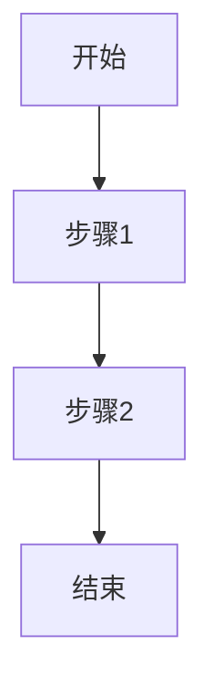

# {{PROJECT_NAME}}

> {{ONE_LINE_DESCRIPTION}}

## 背景

### 业务目标
<!-- 这个项目要解决什么业务问题？ -->

### 核心用户
<!-- 谁在使用这个系统？角色与场景 -->

| 角色 | 场景 | 核心诉求 |
|------|------|----------|
| | | |

### 核心流程
<!-- 用 Mermaid 流程图描述 1-2 个核心业务流程 -->

## 需求概述

### 功能需求
- [ ] 
- [ ] 

### 非功能需求

| 维度 | 目标 | 备注 |
|------|------|------|
| 可用性 | 99.9% | |
| 响应时间 | P95 < 200ms | |
| 并发量 | | |
| 数据规模 | | |
| 安全合规 | | |

## 约束与假设

### 技术约束
- 

### 组织约束
- 

### 关键假设
- 

## 相关文档

| 文档 | 路径 |
|------|------|
| 数据库设计 | [database/schema.md](database/schema.md) |
| ER 图 | [database/er-diagram.md](database/er-diagram.md) |
| API 设计 | [api/](api/) |
| 系统架构 | [architecture/system.md](architecture/system.md) |
| 组件设计 | [architecture/components.md](architecture/components.md) |
| 部署方案 | [architecture/deployment.md](architecture/deployment.md) |
| 决策记录 | [decisions/](decisions/) |
