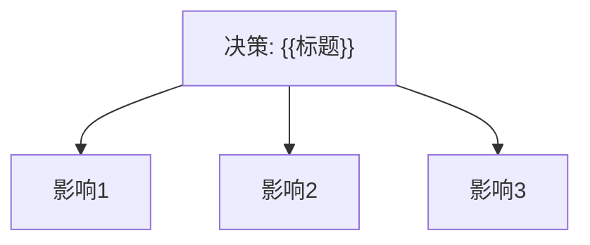

# ADR-{{NNNN}}: {{决策标题}}

## 元信息

| 属性 | 值 |
|------|-----|
| 编号 | ADR-{{NNNN}} |
| 日期 | {{YYYY-MM-DD}} |
| 状态 | Proposed / Accepted / Deprecated / Superseded |
| 作者 | |
| 关联 | ADR-{{NNNN}}, ADR-{{NNNN}} |

## 上下文

> 描述当前面临的架构问题、技术约束和组织背景。发生了什么需要做出决策？

### 业务背景

### 技术背景

### 约束

| 约束 | 类型 | 说明 |
|------|------|------|
| | 技术 / 组织 / 时间 | |

## 决策

> 用一句话描述决策：**我们将...**

### 详细说明

### 架构影响

## 候选方案

### 方案 A：{{方案A名称}}（✅ 采纳）

| 维度 | 评价 |
|------|------|
| 优点 | |
| 缺点 | |
| 风险 | |
| 复杂度 | 低 / 中 / 高 |
| 成本 | 低 / 中 / 高 |

### 方案 B：{{方案B名称}}

| 维度 | 评价 |
|------|------|
| 优点 | |
| 缺点 | |
| 排除原因 | |

### 方案 C：{{方案C名称}}

| 维度 | 评价 |
|------|------|
| 优点 | |
| 缺点 | |
| 排除原因 | |

## 后果

### ✅ 变得更容易

- 

### ⚠️ 变得更困难

- 

### 🔄 需要跟进

- [ ] 

## 迁移计划

<!-- 如果决策涉及变更现有系统，描述迁移步骤 -->

1. 
2. 
3. 

## 回滚策略

<!-- 如果这个决策最终失败，如何回滚？回滚代价有多大？ -->

- **回滚方案**：
- **回滚代价**：
- **不可逆影响**：
