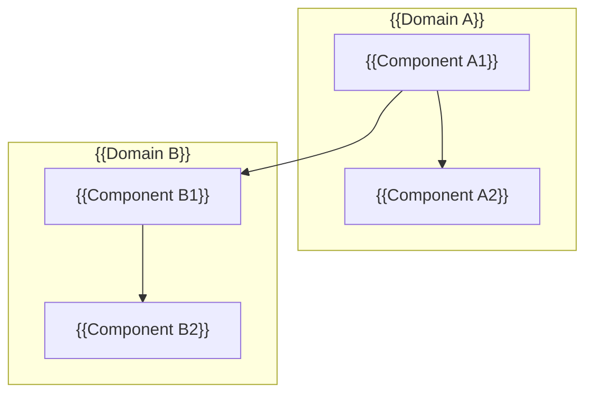
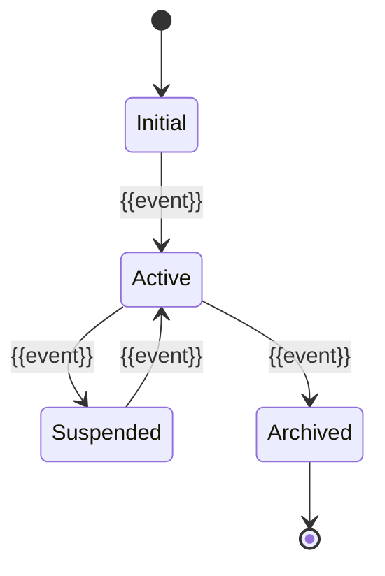

# 组件设计：{{PROJECT_NAME}}

## 模块/组件总览



## {{Component Name}}

### 基本信息

| 属性 | 值 |
|------|-----|
| 所属模块 | |
| 类型 | Service / Repository / Handler / Job / ... |
| 职责 | 单一职责一句话 |
| 依赖 | 入向依赖与出向依赖 |

### 接口定义

```
// {{language}}
interface {{InterfaceName}} {
  // 方法签名
  {{methodName}}({{params}}): {{returnType}}
}
```

### 输入/输出

| 输入 | 类型 | 来源 | 校验 |
|------|------|------|------|
| | | | |

| 输出 | 类型 | 去向 | 副作用 |
|------|------|------|--------|
| | | | |

### 状态机



### 边界规则

- **必须**：
- **禁止**：
- **可选**：

### 测试要点

- 正常路径：
- 边界条件：
- 故障注入：
- 并发场景：

---

## {{Component Name}}

<!-- 重复上述结构 -->
