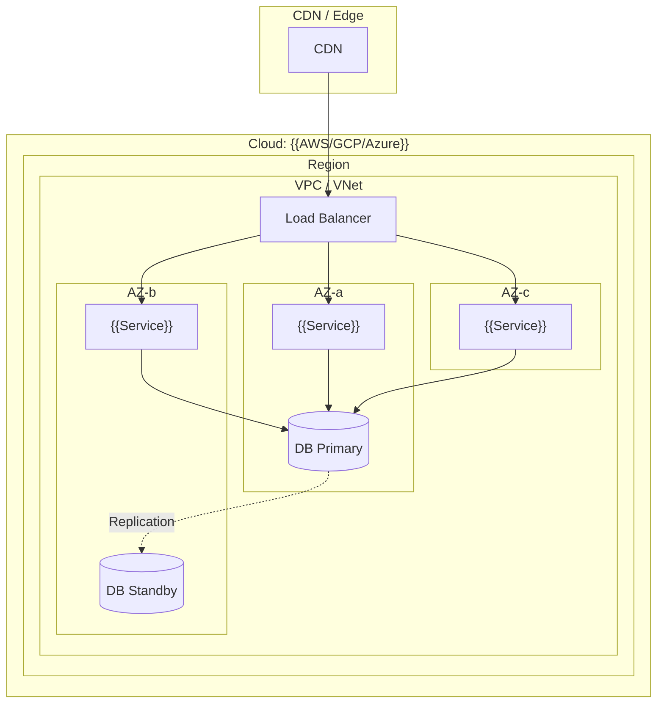
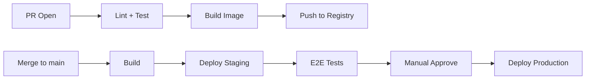

# 部署方案：{{PROJECT_NAME}}

## 部署拓扑



## 基础设施

| 资源 | 规格 | 数量 | 备注 |
|------|------|------|------|
| Compute | {{t3.medium / 2 vCPU 4GB}} | {{N}} | |
| Database | {{db.r5.large / 2 vCPU 16GB}} | {{N}} | |
| Cache | {{cache.m5.large}} | {{N}} | |
| Object Storage | Standard | - | |
| CDN | Standard | - | |

## 容器化

```dockerfile
# {{PROJECT_NAME}} / {{SERVICE}}
FROM {{base_image}}

# Build stage
# ...

# Runtime stage
# ...
```

### 容器编排 (Kubernetes)

```yaml
apiVersion: apps/v1
kind: Deployment
metadata:
  name: {{service}}
  namespace: {{namespace}}
spec:
  replicas: {{N}}
  selector:
    matchLabels:
      app: {{service}}
  template:
    spec:
      containers:
        - name: {{service}}
          image: {{registry}}/{{service}}:{{tag}}
          ports:
            - containerPort: {{port}}
          resources:
            requests:
              cpu: {{100m}}
              memory: {{256Mi}}
            limits:
              cpu: {{500m}}
              memory: {{512Mi}}
          livenessProbe:
            httpGet:
              path: /health
              port: {{port}}
            initialDelaySeconds: {{10}}
            periodSeconds: {{15}}
          readinessProbe:
            httpGet:
              path: /ready
              port: {{port}}
            initialDelaySeconds: {{5}}
            periodSeconds: {{10}}
          env:
            - name: ENV
              value: {{production}}
            - name: DB_URL
              valueFrom:
                secretKeyRef:
                  name: {{service}}-db
                  key: url
```

## 环境矩阵

| 环境 | 用途 | 规模 | 数据 | 自动扩缩 |
|------|------|------|------|----------|
| dev | 本地开发 | 最小 | Mock | - |
| staging | 集成测试 | 生产 1/4 | 脱敏生产数据 | 否 |
| production | 线上 | 多 AZ | 真实数据 | 是 |

## CI/CD



## 扩缩策略

| 服务 | 指标 | 阈值 | 最小副本 | 最大副本 |
|------|------|------|----------|----------|
| | CPU | > 70% | {{2}} | {{10}} |
| | Memory | > 80% | {{2}} | {{10}} |
| | Queue Depth | > 1000 | {{1}} | {{20}} |

## 备份与恢复

| 数据 | 频率 | 保留 | RPO | RTO | 恢复验证 |
|------|------|------|-----|-----|----------|
| Database | Daily + Continuous WAL | 30 days | < 1 min | < 15 min | Monthly |
| File Storage | Daily | 90 days | 24 hours | < 1 hour | Quarterly |
