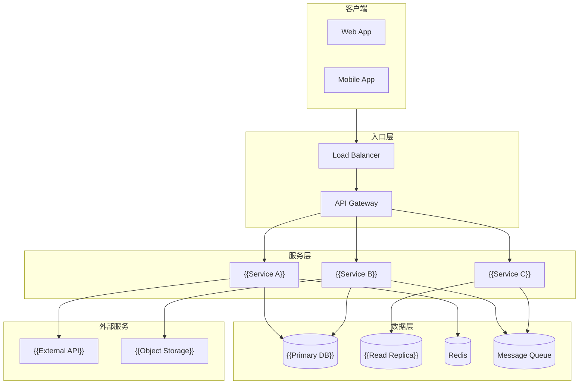
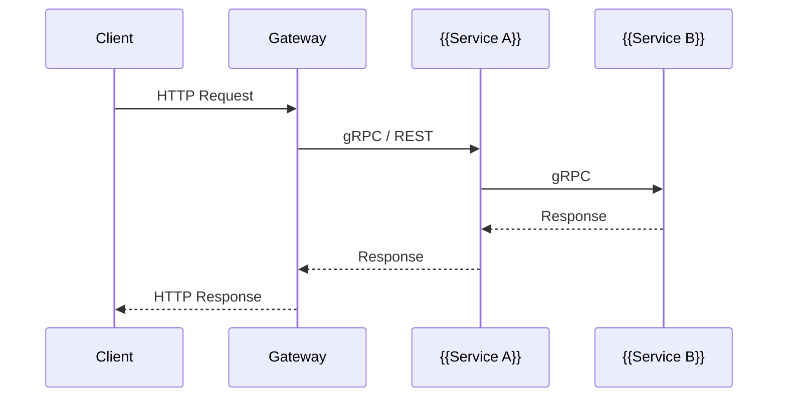
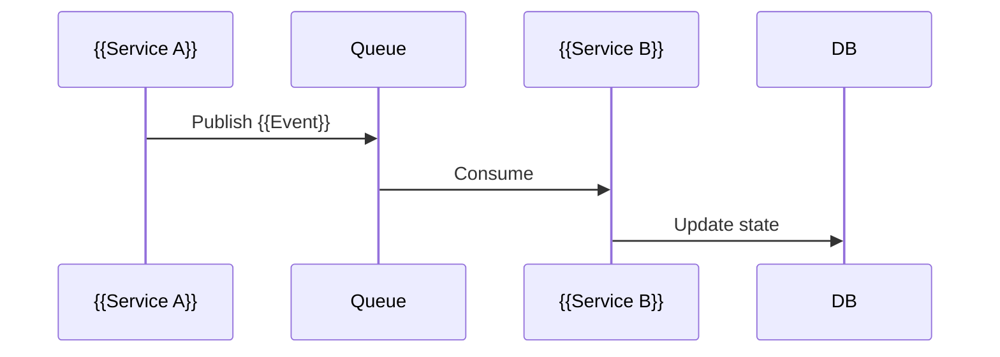
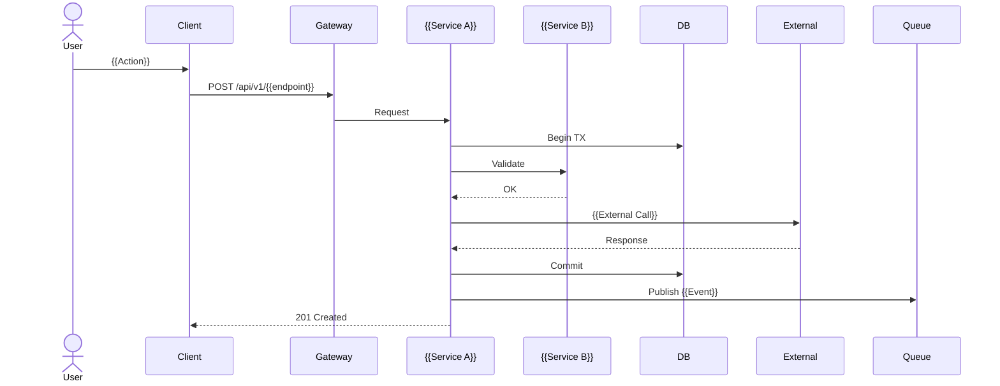
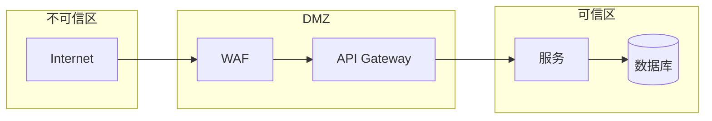

# 系统架构：{{PROJECT_NAME}}

## 架构概览

**架构风格**：{{Monolith / Modular Monolith / Microservices / Serverless / Hybrid}}

### 架构全景图



## 架构决策

| 维度 | 选择 | 理由 | 替代方案 |
|------|------|------|----------|
| 架构风格 | | | |
| 通信协议 | | | |
| 数据策略 | | | |
| 部署方式 | | | |
| 身份认证 | | | |

## 服务职责

### {{Service A}}

| 属性 | 值 |
|------|-----|
| 职责 | |
| 限界上下文 | |
| 技术栈 | |
| 数据存储 | |
| API 端点 | |
| 依赖服务 | |
| SLO | 99.9% 可用性, P95 < 200ms |

**核心接口**：

```
GET    /api/v1/{{resource}}
POST   /api/v1/{{resource}}
GET    /api/v1/{{resource}}/{id}
PATCH  /api/v1/{{resource}}/{id}
DELETE /api/v1/{{resource}}/{id}
```

**发布/订阅事件**：

| 事件 | 方向 | Schema |
|------|------|--------|
| {{Resource}}Created | publish | |
| {{Resource}}Updated | publish | |
| | subscribe | |

---

### {{Service B}}

<!-- 同上 -->

---

## 通信模式

### 同步调用



### 异步事件



### 关键流程：{{FLOW_NAME}}



## 可靠性设计

### 故障模式

| 故障 | 影响 | 处理策略 |
|------|------|----------|
| {{Service}} 宕机 | | 断路器 + 降级 |
| 数据库主库故障 | | 自动 failover |
| 外部 API 超时 | | 重试 3 次 + 熔断 |
| 消息积压 | | 消费者自动扩容 |

### 韧性模式

- **超时**：所有外部调用设置超时（连接 {{X}}s，读取 {{Y}}s）
- **重试**：指数退避，最大 {{N}} 次，仅对幂等操作
- **断路器**：{{N}} 次失败 → OPEN，{{M}}s 后 HALF_OPEN
- **舱壁**：按服务分配独立线程池/连接池
- **降级**：非关键功能故障时返回缓存/默认值

## 可观测性

| 信号 | 工具 | 保留期 |
|------|------|--------|
| Logs | | |
| Metrics | | |
| Traces | | |
| Alerts | | |

## 安全边界


